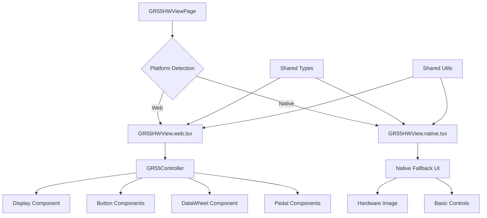

# Design Document: GR55 Hardware View Integration

## Overview

This design addresses the integration of the GR55 Hardware View component into the React Native application. The current implementation exists as a standalone web component using Tailwind CSS and web-specific libraries (framer-motion, lucide-react) outside the main application structure. The design will move these components into the proper React Native project structure while maintaining cross-platform compatibility and preserving the original visual design.

**Design Reference**: The target visual design is documented in `GR55HWDesign.png` located in this specs folder, which shows the expected Roland GR-55 Guitar Synthesizer interface with authentic hardware appearance, interactive controls, and proper proportions.

The solution involves creating a hybrid approach where web platforms use the rich interactive interface matching the reference design while native platforms receive an appropriate fallback or simplified version, all managed through React Native's platform-specific file extensions and conditional rendering.

## Architecture

### Component Structure



### Directory Structure

The components will be reorganized into the main application structure:

```
src/
├── components/
│   └── hardware-view/
│       ├── GR55HWView.web.tsx          # Web-specific implementation
│       ├── GR55HWView.native.tsx       # Native fallback implementation
│       ├── GR55HWView.types.ts         # Shared TypeScript types
│       ├── components/
│       │   ├── Buttons.tsx             # Button components (web-only)
│       │   ├── Display.tsx             # LCD display component (web-only)
│       │   ├── DataWheel.tsx           # Data wheel component (web-only)
│       │   ├── Pedal.tsx               # Pedal components (web-only)
│       │   └── NativeFallback.tsx      # Native platform components
│       └── utils/
│           ├── cn.ts                   # Class name utility (web-only)
│           └── constants.ts            # Shared constants
└── screens/
    └── GR55HWViewPage.tsx              # Updated main screen component
```

### Platform-Specific Implementation Strategy

**Web Platform:**

- Full interactive GR55 interface with Tailwind CSS styling
- Framer Motion animations for tactile feedback
- Complete component hierarchy with all interactive elements

**Native Platforms:**

- Simplified interface using React Native components
- Static hardware image with basic interactive overlays
- Essential controls using native UI elements
- Graceful degradation message explaining web-only features

## Components and Interfaces

### Core Component Interface

```typescript
// GR55HWView.types.ts
export interface GR55State {
  activePedal: number;
  patchName: string;
  activeStyle: "LEAD" | "RHYTHM" | "OTHER" | "USER";
  bank: string;
}

export interface GR55Actions {
  setActivePedal: (pedal: number) => void;
  setPatchName: (name: string) => void;
  setActiveStyle: (style: GR55State["activeStyle"]) => void;
}

export interface GR55HWViewProps {
  initialState?: Partial<GR55State>;
  onStateChange?: (state: GR55State) => void;
}

export interface StyleButtonConfig {
  id: string;
  label: string;
  patch: string;
}
```

### Platform-Specific Components

**Web Implementation (GR55HWView.web.tsx):**

```typescript
import React, { useState } from "react";
import { GR55Controller } from "./components/GR55Controller";
import { GR55HWViewProps, GR55State } from "./GR55HWView.types";

export function GR55HWView({ initialState, onStateChange }: GR55HWViewProps) {
  const [state, setState] = useState<GR55State>({
    activePedal: 1,
    patchName: "LEAD GUITAR",
    activeStyle: "LEAD",
    bank: "01-1",
    ...initialState,
  });

  const handleStateChange = (newState: Partial<GR55State>) => {
    const updatedState = { ...state, ...newState };
    setState(updatedState);
    onStateChange?.(updatedState);
  };

  return (
    <div className="min-h-screen bg-zinc-900 flex flex-col items-center justify-center p-4">
      <div className="scale-[0.8] md:scale-100 origin-center">
        <GR55Controller state={state} onStateChange={handleStateChange} />
      </div>
      <p className="text-zinc-500 mt-4 text-sm font-mono">
        Roland GR-55 Interactive Demo
      </p>
    </div>
  );
}
```

**Native Implementation (GR55HWView.native.tsx):**

```typescript
import React, { useState } from "react";
import { View, Text, Image, TouchableOpacity, StyleSheet } from "react-native";
import { GR55HWViewProps, GR55State } from "./GR55HWView.types";

export function GR55HWView({ initialState, onStateChange }: GR55HWViewProps) {
  const [state, setState] = useState<GR55State>({
    activePedal: 1,
    patchName: "LEAD GUITAR",
    activeStyle: "LEAD",
    bank: "01-1",
    ...initialState,
  });

  return (
    <View style={styles.container}>
      <Text style={styles.title}>Roland GR-55 Hardware View</Text>
      <Text style={styles.subtitle}>
        Full interactive hardware view available on web platform
      </Text>

      {/* Static hardware image */}
      <Image
        source={require("../../../assets/gr55-hardware.png")}
        style={styles.hardwareImage}
        resizeMode="contain"
      />

      {/* Basic controls */}
      <View style={styles.controlsContainer}>
        <Text style={styles.currentPatch}>
          Current Patch: {state.bank} {state.patchName}
        </Text>

        <View style={styles.styleButtons}>
          {["LEAD", "RHYTHM", "OTHER", "USER"].map((style) => (
            <TouchableOpacity
              key={style}
              style={[
                styles.styleButton,
                state.activeStyle === style && styles.activeStyleButton,
              ]}
              onPress={() => {
                const newState = {
                  ...state,
                  activeStyle: style as GR55State["activeStyle"],
                };
                setState(newState);
                onStateChange?.(newState);
              }}
            >
              <Text style={styles.styleButtonText}>{style}</Text>
            </TouchableOpacity>
          ))}
        </View>
      </View>
    </View>
  );
}
```

### Updated Main Screen Component

```typescript
// src/screens/GR55HWViewPage.tsx
import React from "react";
import { Platform } from "react-native";
import { GR55HWView } from "../components/hardware-view/GR55HWView";

export default function GR55HWViewPage() {
  return <GR55HWView />;
}
```

## Data Models

### State Management

The hardware view will use local React state for managing the interface state. The state structure follows the existing patterns in the original component:

```typescript
interface GR55State {
  // Current active pedal (1-4)
  activePedal: number;

  // Current patch name displayed on LCD
  patchName: string;

  // Active sound style selection
  activeStyle: "LEAD" | "RHYTHM" | "OTHER" | "USER";

  // Current bank display (e.g., "01-1")
  bank: string;
}
```

### Style Configuration

```typescript
interface StyleConfig {
  styles: StyleButtonConfig[];
}

const DEFAULT_STYLES: StyleButtonConfig[] = [
  { id: "LEAD", label: "LEAD", patch: "LEAD GUITAR" },
  { id: "RHYTHM", label: "RHYTHM", patch: "FUNK RHYTHM" },
  { id: "OTHER", label: "OTHER", patch: "STRINGS ENS" },
  { id: "USER", label: "USER", patch: "CUSTOM 01" },
];
```

## Correctness Properties

_A property is a characteristic or behavior that should hold true across all valid executions of a system-essentially, a formal statement about what the system should do. Properties serve as the bridge between human-readable specifications and machine-verifiable correctness guarantees._

### Property 1: Component Structure Integrity

_For any_ build process, all GR55HWView components should be located within the src directory structure and use relative import paths
**Validates: Requirements 1.1, 1.2**

### Property 2: Platform-Specific Component Loading

_For any_ platform (web or native), the system should load the correct platform-specific implementation without cross-contamination
**Validates: Requirements 2.1, 2.2, 2.3**

### Property 3: Dependency Isolation

_For any_ build target, web-specific dependencies should only be included in web builds and excluded from native builds
**Validates: Requirements 3.2, 3.3**

### Property 4: State Synchronization

_For any_ user interaction with controls, the interface state and display should update consistently to reflect the changes
**Validates: Requirements 4.3, 5.1**

### Property 5: Cross-Platform Styling Compatibility

_For any_ component, styling should use React Native compatible approaches and avoid web-only CSS classes in cross-platform code
**Validates: Requirements 2.4, 4.4**

### Property 6: Navigation Integration

_For any_ navigation to the Hardware tab, the system should display the appropriate hardware view for the current platform
**Validates: Requirements 6.1, 6.4**

### Property 7: Performance Requirements

_For any_ hardware view initialization, the loading process should complete within 2 seconds and interactions should respond within 100ms
**Validates: Requirements 7.1, 7.2**

### Property 8: Error Handling Robustness

_For any_ error condition (dependency failures, platform detection failures, component errors), the system should gracefully handle the error and provide appropriate fallbacks
**Validates: Requirements 9.1, 9.2, 9.3**

### Property 9: Memory Management

_For any_ component lifecycle, the system should efficiently manage resources and prevent memory leaks during mount/unmount cycles
**Validates: Requirements 7.4**

### Property 10: Interactive Feedback Consistency

_For any_ user interaction (pedals, buttons, data wheel), the system should provide appropriate visual feedback and execute expected actions
**Validates: Requirements 5.2, 5.3, 5.4**

## Error Handling

### Platform Detection Errors

- **Fallback Strategy**: If platform detection fails, default to native implementation
- **Error Boundaries**: Wrap hardware view components in error boundaries to catch rendering errors
- **Graceful Degradation**: Provide meaningful error messages when web features aren't available

### Dependency Loading Errors

- **Conditional Imports**: Use dynamic imports for web-specific dependencies with try/catch blocks
- **Feature Detection**: Check for required APIs before attempting to use them
- **Alternative Implementations**: Provide React Native alternatives for web-specific functionality

### Component Rendering Errors

- **Error Boundaries**: Implement error boundaries at component level to isolate failures
- **Recovery UI**: Display user-friendly error messages with recovery options
- **Logging**: Capture and log errors for debugging purposes

### Build System Errors

- **Dependency Validation**: Validate that required dependencies are available during build
- **Platform-Specific Exclusions**: Ensure web-only dependencies are properly excluded from native builds
- **Import Resolution**: Verify that all imports can be resolved correctly

## Testing Strategy

### Dual Testing Approach

The testing strategy combines unit tests for specific functionality with property-based tests for universal behaviors:

**Unit Tests:**

- Platform detection logic
- Component rendering on different platforms
- Error boundary behavior
- State management functions
- Import path validation

**Property-Based Tests:**

- Cross-platform compatibility across multiple platform configurations
- State synchronization across various user interaction sequences
- Performance characteristics under different load conditions
- Error handling across various failure scenarios
- Memory management during component lifecycle operations

### Testing Configuration

- **Property Test Iterations**: Minimum 100 iterations per property test
- **Test Framework**: Jest with React Native Testing Library
- **Property Testing Library**: fast-check for JavaScript property-based testing
- **Performance Testing**: Use React Native performance monitoring tools
- **Cross-Platform Testing**: Test on both web and native platforms

### Test Organization

```
__tests__/
├── hardware-view/
│   ├── GR55HWView.test.tsx              # Unit tests
│   ├── GR55HWView.properties.test.tsx   # Property-based tests
│   ├── platform-detection.test.tsx      # Platform-specific tests
│   └── performance.test.tsx             # Performance tests
```

Each property test will be tagged with:
**Feature: gr55-hardware-view-integration, Property {number}: {property_text}**

### Mock Strategy

- Mock framer-motion for native platform tests
- Mock platform detection for cross-platform testing
- Mock performance APIs for consistent testing
- Use React Native Testing Library utilities for component testing
