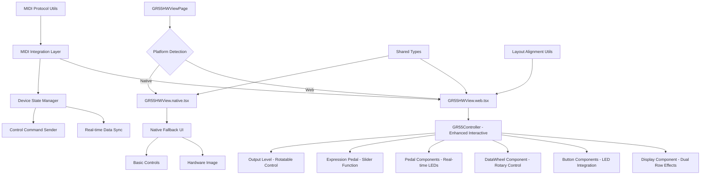
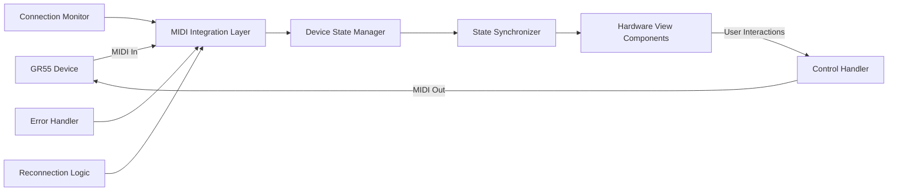
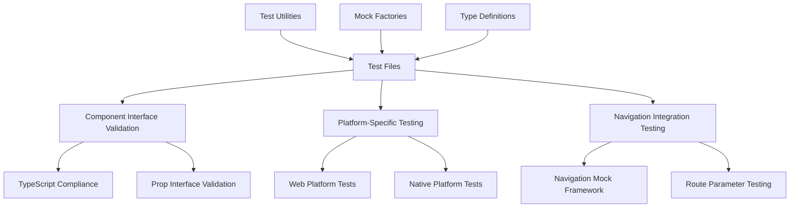

# Design Document: GR55 Hardware View Integration

## Overview

This design addresses the integration of the GR55 Hardware View component into the React Native application. The current implementation exists as a standalone web component using Tailwind CSS and web-specific libraries (framer-motion, lucide-react) outside the main application structure. The design will move these components into the proper React Native project structure while maintaining cross-platform compatibility and preserving the original visual design.

**Design Reference**: The target visual design is documented in `GR55HWDesign.png` located in this specs folder, which shows the expected Roland GR-55 Guitar Synthesizer interface with authentic hardware appearance, interactive controls, and proper proportions.

The solution involves creating a hybrid approach where web platforms use the rich interactive interface matching the reference design while native platforms receive an appropriate fallback or simplified version, all managed through React Native's platform-specific file extensions and conditional rendering.

## Architecture

### Enhanced Component Structure with Real-Time Integration



### Real-Time Data Integration Architecture



### Enhanced Layout Alignment System

The enhanced hardware view implements precise alignment following these principles:

1. **Horizontal Alignment Groups**: All related elements align on consistent horizontal planes
2. **Vertical Spacing Optimization**: Reduced spacing between page controls and foot pedals
3. **LED State Integration**: All LEDs reflect real device state with proper mutual exclusivity
4. **Interactive Controls**: Rotatable and slider controls with visual feedback
5. **Extended Display**: Two-row effects display with real-time status updates

### Design Source Priority

**Primary Design Source**: `./Docs/Design/src/` - Contains the superior, complete design implementation

- Full Tailwind CSS styling matching GR55HWDesign.png
- Authentic hardware appearance with proper 3D effects
- Complete component hierarchy with all interactive elements
- Framer Motion animations for tactile feedback

**Secondary Source**: `./GR55HWView/` - Used for basic structure and integration patterns

- Provides React Native compatibility patterns
- Basic component interfaces and state management

### Testing Architecture



**Testing Quality Requirements:**

1. **TypeScript Compliance**: All test files must compile without type errors
2. **Component Interface Accuracy**: Tests must only pass props that components actually accept
3. **Navigation Testing**: Proper mocks that match React Navigation interfaces
4. **Consistent Patterns**: Standardized test utilities and mock factories

**Current Testing Issues:**

- `GR55HWViewPage` component doesn't accept navigation props but tests try to pass them
- React Test Renderer deprecation warnings need addressing
- Component interface validation needs improvement
- Platform detection and conditional rendering approaches

**Integration Strategy**:

1. Use `./Docs/Design/src/` components as the visual foundation
2. Adapt them for React Native compatibility using patterns from `./GR55HWView/`
3. Maintain the superior visual design while ensuring cross-platform functionality

### Directory Structure

The components will be reorganized into the main application structure using the superior design files:

```
src/
├── components/
│   └── hardware-view/
│       ├── GR55HWView.web.tsx          # Web-specific implementation
│       ├── GR55HWView.native.tsx       # Native fallback implementation
│       ├── GR55HWView.types.ts         # Shared TypeScript types
│       ├── components/
│       │   ├── GR55Controller.tsx      # Main controller (from superior design)
│       │   ├── Buttons.tsx             # Enhanced button components
│       │   ├── Display.tsx             # Enhanced LCD display component
│       │   ├── DataWheel.tsx           # Enhanced data wheel component
│       │   ├── Pedal.tsx               # Enhanced pedal components
│       │   └── NativeFallback.tsx      # Native platform components
│       └── utils/
│           ├── cn.ts                   # Class name utility (enhanced)
│           ├── constants.ts            # Shared constants
│           └── tailwindCompat.ts       # Tailwind to React Native compatibility
└── screens/
    └── GR55HWViewPage.tsx              # Updated main screen component

Reference Sources:
├── Docs/Design/src/                    # Superior design files (PRIMARY)
│   ├── Component.tsx                   # Complete GR55Controller implementation
│   ├── components/                     # Enhanced component implementations
│   └── utils.ts                        # Tailwind utilities
└── GR55HWView/                         # Basic integration patterns (SECONDARY)
    ├── Component.tsx                   # Basic structure reference
    └── components/                     # Basic component patterns
```

### Platform-Specific Implementation Strategy

**Web Platform:**

- Full interactive GR55 interface with Tailwind CSS styling
- Framer Motion animations for tactile feedback
- Complete component hierarchy with all interactive elements

**Native Platforms:**

- Simplified interface using React Native components
- Static hardware image with basic interactive overlays
- Essential controls using native UI elements
- Graceful degradation message explaining web-only features

## Components and Interfaces

### Enhanced Core Component Interface

```typescript
// GR55HWView.types.ts - Enhanced for real-time integration
export interface GR55EnhancedState {
  // Device connection
  isConnected: boolean;
  connectionStatus: "disconnected" | "connecting" | "connected" | "error";

  // Current active pedal (1-4) with mutual exclusivity
  activePedal: number;
  pedalLEDs: {
    pedal1: boolean;
    pedal2: boolean;
    pedal3: boolean;
    ctl: boolean; // Independent from 1,2,3
  };

  // Current patch information from device
  patchName: string;
  bank: string;

  // Active sound style selection with LED states
  activeStyle: "LEAD" | "RHYTHM" | "OTHER" | "USER";
  styleLEDs: {
    lead: boolean;
    rhythm: boolean;
    other: boolean;
    user: boolean;
    vlink: boolean;
  };

  // Tone source information
  toneSource: {
    guitar: boolean;
    pcm: boolean;
    activeTone: "guitar" | "pcm" | "both";
  };

  // Effects status (real device state)
  effects: {
    // Row 1 in display
    mfx: boolean;
    delay: boolean;
    chorus: boolean;
    reverb: boolean;
    // Row 2 in display
    amp: boolean;
    ns: boolean;
    mod: boolean;
    eq: boolean;
  };

  // Control states
  controls: {
    ezEdit: boolean;
    exit: boolean;
    enter: boolean;
    write: boolean;
    pageLeft: boolean;
    pageRight: boolean;
    edit: boolean;
  };

  // Physical controls
  outputLevel: number; // 0-127, rotatable with start/stop
  dataWheel: number; // Rotary position
  expressionPedal: number; // 0-127, slider representation
  expSwitch: boolean; // With LED indicator

  // Bank selection
  bankSelect: {
    up: boolean;
    down: boolean;
  };
}

export interface GR55EnhancedActions {
  // Device connection
  connect: () => Promise<void>;
  disconnect: () => void;

  // Control actions
  setActivePedal: (pedal: number) => void;
  setPatchName: (name: string) => void;
  setActiveStyle: (style: GR55EnhancedState["activeStyle"]) => void;

  // Physical control actions
  setOutputLevel: (level: number) => void;
  setDataWheel: (position: number) => void;
  setExpressionPedal: (value: number) => void;

  // Effect control actions
  toggleEffect: (effect: keyof GR55EnhancedState["effects"]) => void;

  // Bank control actions
  bankUp: () => void;
  bankDown: () => void;
}

export interface GR55HWViewEnhancedProps {
  initialState?: Partial<GR55EnhancedState>;
  onStateChange?: (state: GR55EnhancedState) => void;
  onMIDICommand?: (command: MIDICommand) => void;
  deviceConnected?: boolean;
}

export interface MIDICommand {
  type: "cc" | "sysex" | "note";
  channel?: number;
  controller?: number;
  value?: number;
  data?: Uint8Array;
}

export interface LayoutAlignment {
  // Horizontal alignment groups
  topRowHeadings: AlignmentGroup;
  buttonRow: AlignmentGroup;
  pageControls: AlignmentGroup;
  footPedals: AlignmentGroup;
  audioPlayer: AlignmentGroup;
  display: DisplayLayout;
}

interface AlignmentGroup {
  [key: string]: { x: number; y: number };
}

interface DisplayLayout {
  topRow: { height: number; y: number };
  midRow: { height: number; y: number };
  bottomArea: { height: number; y: number; rows: 2 };
}
```

### Enhanced Platform-Specific Components

**Enhanced Web Implementation (GR55HWView.web.tsx):**

```typescript
import React, { useState, useEffect, useCallback } from "react";
import { GR55EnhancedController } from "./components/GR55EnhancedController";
import { MIDIIntegrationLayer } from "./utils/midiIntegration";
import { GR55HWViewEnhancedProps, GR55EnhancedState } from "./GR55HWView.types";

export function GR55HWView({
  initialState,
  onStateChange,
  onMIDICommand,
  deviceConnected = false,
}: GR55HWViewEnhancedProps) {
  const [state, setState] = useState<GR55EnhancedState>({
    isConnected: deviceConnected,
    connectionStatus: deviceConnected ? "connected" : "disconnected",
    activePedal: 1,
    pedalLEDs: { pedal1: true, pedal2: false, pedal3: false, ctl: false },
    patchName: "LEAD GUITAR",
    bank: "01-1",
    activeStyle: "LEAD",
    styleLEDs: {
      lead: true,
      rhythm: false,
      other: false,
      user: false,
      vlink: false,
    },
    toneSource: { guitar: true, pcm: false, activeTone: "guitar" },
    effects: {
      mfx: true,
      delay: false,
      chorus: true,
      reverb: false,
      amp: true,
      ns: false,
      mod: false,
      eq: true,
    },
    controls: {
      ezEdit: false,
      exit: false,
      enter: false,
      write: false,
      pageLeft: false,
      pageRight: false,
      edit: false,
    },
    outputLevel: 64,
    dataWheel: 0,
    expressionPedal: 0,
    expSwitch: false,
    bankSelect: { up: false, down: false },
    ...initialState,
  });

  // MIDI integration
  const midiLayer = new MIDIIntegrationLayer();

  const handleStateChange = useCallback(
    (newState: Partial<GR55EnhancedState>) => {
      const updatedState = { ...state, ...newState };
      setState(updatedState);
      onStateChange?.(updatedState);

      // Send MIDI commands for control changes
      if (onMIDICommand) {
        // Generate appropriate MIDI commands based on state changes
        const commands = midiLayer.generateMIDICommands(state, newState);
        commands.forEach((command) => onMIDICommand(command));
      }
    },
    [state, onStateChange, onMIDICommand, midiLayer]
  );

  // Real-time device state synchronization
  useEffect(() => {
    if (state.isConnected) {
      const syncInterval = setInterval(() => {
        // Poll device state and update if changed
        midiLayer.pollDeviceState().then((deviceState) => {
          if (deviceState) {
            handleStateChange(deviceState);
          }
        });
      }, 50); // 20Hz update rate for sub-100ms response

      return () => clearInterval(syncInterval);
    }
  }, [state.isConnected, handleStateChange, midiLayer]);

  return (
    <div className="min-h-screen bg-zinc-900 flex flex-col items-center justify-center p-4">
      <div className="scale-[0.8] md:scale-100 origin-center">
        <GR55EnhancedController
          state={state}
          onStateChange={handleStateChange}
          layoutAlignment={ENHANCED_LAYOUT_CONFIG}
        />
      </div>
      <div className="mt-4 text-center">
        <p className="text-zinc-500 text-sm font-mono">
          Roland GR-55 Enhanced Interactive Interface
        </p>
        <p className="text-zinc-400 text-xs">
          Status: {state.connectionStatus} | Patch: {state.bank}{" "}
          {state.patchName}
        </p>
      </div>
    </div>
  );
}

// Enhanced layout configuration with precise alignment
const ENHANCED_LAYOUT_CONFIG: LayoutAlignment = {
  topRowHeadings: {
    vlink: { x: 50, y: 20 },
    lead: { x: 150, y: 20 },
    rhythm: { x: 250, y: 20 },
    other: { x: 350, y: 20 },
    user: { x: 450, y: 20 },
    ezEdit: { x: 550, y: 20 },
    exit: { x: 650, y: 20 },
    enter: { x: 750, y: 20 },
    write: { x: 850, y: 20 },
  },
  buttonRow: {
    vlink: { x: 50, y: 60 },
    lead: { x: 150, y: 60 },
    rhythm: { x: 250, y: 60 },
    other: { x: 350, y: 60 },
    user: { x: 450, y: 60 },
    ez: { x: 550, y: 60 },
    exit: { x: 650, y: 60 },
    enter: { x: 750, y: 60 },
    write: { x: 850, y: 60 },
  },
  pageControls: {
    pageLeft: { x: 200, y: 300 },
    pageRight: { x: 300, y: 300 },
    edit: { x: 400, y: 300 },
  },
  footPedals: {
    pedal1: { x: 150, y: 400 },
    pedal2: { x: 250, y: 400 },
    pedal3: { x: 350, y: 400 },
    ctl: { x: 450, y: 400 },
    bankDown: { x: 180, y: 380 }, // Right of pedal 1, top aligned
    bankUp: { x: 280, y: 400 }, // Right of pedal 2
  },
  audioPlayer: {
    button: { x: 450, y: 350 }, // Aligned with CTL pedal
    topText: { x: 450, y: 330 },
    bottomText: { x: 450, y: 370 },
  },
  display: {
    topRow: { height: 30, y: 150 }, // Guitar, PCM indicators
    midRow: { height: 40, y: 180 }, // Patch name
    bottomArea: { height: 60, y: 220, rows: 2 }, // Extended for effects
  },
};
```

### Enhanced Component Architecture

**Enhanced GR55Controller Component:**

```typescript
// components/GR55EnhancedController.tsx
import React from "react";
import { EnhancedDisplay } from "./EnhancedDisplay";
import { EnhancedButtons } from "./EnhancedButtons";
import { EnhancedPedals } from "./EnhancedPedals";
import { EnhancedControls } from "./EnhancedControls";
import { GR55EnhancedState, LayoutAlignment } from "../GR55HWView.types";

interface GR55EnhancedControllerProps {
  state: GR55EnhancedState;
  onStateChange: (newState: Partial<GR55EnhancedState>) => void;
  layoutAlignment: LayoutAlignment;
}

export function GR55EnhancedController({
  state,
  onStateChange,
  layoutAlignment,
}: GR55EnhancedControllerProps) {
  return (
    <div className="relative w-[1000px] h-[600px] bg-gradient-to-b from-zinc-800 to-zinc-900 rounded-lg shadow-2xl">
      {/* Enhanced Display with two-row effects */}
      <EnhancedDisplay
        state={state}
        layout={layoutAlignment.display}
        className="absolute"
        style={{
          left: 300,
          top: layoutAlignment.display.topRow.y,
          width: 400,
          height:
            layoutAlignment.display.topRow.height +
            layoutAlignment.display.midRow.height +
            layoutAlignment.display.bottomArea.height,
        }}
      />

      {/* Enhanced Button Array with precise alignment */}
      <EnhancedButtons
        state={state}
        onStateChange={onStateChange}
        layout={layoutAlignment}
        className="absolute"
      />

      {/* Enhanced Pedals with LED indicators */}
      <EnhancedPedals
        state={state}
        onStateChange={onStateChange}
        layout={layoutAlignment.footPedals}
        className="absolute"
      />

      {/* Enhanced Rotatable Controls */}
      <EnhancedControls
        state={state}
        onStateChange={onStateChange}
        layout={layoutAlignment}
        className="absolute"
      />
    </div>
  );
}
```

## Data Models

### Enhanced State Management

The hardware view will use comprehensive state management to handle real-time GR55 device integration and enhanced interactivity:

```typescript
interface GR55EnhancedState {
  // Device connection
  isConnected: boolean;
  connectionStatus: "disconnected" | "connecting" | "connected" | "error";

  // Current active pedal (1-4) with mutual exclusivity
  activePedal: number;
  pedalLEDs: {
    pedal1: boolean;
    pedal2: boolean;
    pedal3: boolean;
    ctl: boolean; // Independent from 1,2,3
  };

  // Current patch information from device
  patchName: string;
  bank: string;

  // Active sound style selection with LED states
  activeStyle: "LEAD" | "RHYTHM" | "OTHER" | "USER";
  styleLEDs: {
    lead: boolean;
    rhythm: boolean;
    other: boolean;
    user: boolean;
    vlink: boolean;
  };

  // Tone source information
  toneSource: {
    guitar: boolean;
    pcm: boolean;
    activeTone: "guitar" | "pcm" | "both";
  };

  // Effects status (real device state)
  effects: {
    // Row 1 in display
    mfx: boolean;
    delay: boolean;
    chorus: boolean;
    reverb: boolean;
    // Row 2 in display
    amp: boolean;
    ns: boolean;
    mod: boolean;
    eq: boolean;
  };

  // Control states
  controls: {
    ezEdit: boolean;
    exit: boolean;
    enter: boolean;
    write: boolean;
    pageLeft: boolean;
    pageRight: boolean;
    edit: boolean;
  };

  // Physical controls
  outputLevel: number; // 0-127, rotatable with start/stop
  dataWheel: number; // Rotary position
  expressionPedal: number; // 0-127, slider representation
  expSwitch: boolean; // With LED indicator

  // Bank selection
  bankSelect: {
    up: boolean;
    down: boolean;
  };
}
```

### MIDI Integration Data Models

```typescript
interface MIDIControlMapping {
  // Control Change mappings for GR55
  outputLevel: { cc: number; channel: number };
  expressionPedal: { cc: number; channel: number };

  // System Exclusive mappings for patch data
  patchRequest: Uint8Array;
  effectsRequest: Uint8Array;

  // Button mappings
  buttons: {
    [key: string]: { cc?: number; sysex?: Uint8Array };
  };
}

interface DeviceState {
  lastUpdate: number;
  patchData: Uint8Array;
  effectsData: Uint8Array;
  controllerData: Map<number, number>;
}
```

### Layout Configuration

```typescript
interface LayoutAlignment {
  // Horizontal alignment groups
  topRowHeadings: {
    vlink: { x: number; y: number };
    lead: { x: number; y: number };
    rhythm: { x: number; y: number };
    other: { x: number; y: number };
    user: { x: number; y: number };
    ezEdit: { x: number; y: number };
    exit: { x: number; y: number };
    enter: { x: number; y: number };
    write: { x: number; y: number };
  };

  buttonRow: {
    vlink: { x: number; y: number };
    lead: { x: number; y: number };
    rhythm: { x: number; y: number };
    other: { x: number; y: number };
    user: { x: number; y: number };
    ez: { x: number; y: number };
    exit: { x: number; y: number };
    enter: { x: number; y: number };
    write: { x: number; y: number };
  };

  pageControls: {
    pageLeft: { x: number; y: number };
    pageRight: { x: number; y: number };
    edit: { x: number; y: number };
  };

  footPedals: {
    pedal1: { x: number; y: number };
    pedal2: { x: number; y: number };
    pedal3: { x: number; y: number };
    ctl: { x: number; y: number };
    bankUp: { x: number; y: number }; // Right of pedal 2
    bankDown: { x: number; y: number }; // Right of pedal 1
  };

  audioPlayer: {
    button: { x: number; y: number }; // Aligned with CTL pedal
    topText: { x: number; y: number };
    bottomText: { x: number; y: number };
  };

  display: {
    topRow: { height: number }; // Guitar, PCM indicators
    midRow: { height: number }; // Patch name
    bottomArea: { height: number }; // Extended for two effect rows
  };
}

## Correctness Properties

_A property is a characteristic or behavior that should hold true across all valid executions of a system-essentially, a formal statement about what the system should do. Properties serve as the bridge between human-readable specifications and machine-verifiable correctness guarantees._

### Property 1: Component Structure Integrity

_For any_ build process, all GR55HWView components should be located within the src directory structure and use relative import paths
**Validates: Requirements 1.1, 1.2**

### Property 2: Platform-Specific Component Loading

_For any_ platform (web or native), the system should load the correct platform-specific implementation without cross-contamination
**Validates: Requirements 2.1, 2.2, 2.3**

### Property 3: Dependency Isolation

_For any_ build target, web-specific dependencies should only be included in web builds and excluded from native builds
**Validates: Requirements 3.2, 3.3**

### Property 4: State Synchronization

_For any_ user interaction with controls, the interface state and display should update consistently to reflect the changes
**Validates: Requirements 4.3, 5.1**

### Property 5: Cross-Platform Styling Compatibility

_For any_ component, styling should use React Native compatible approaches and avoid web-only CSS classes in cross-platform code
**Validates: Requirements 2.4, 4.4**

### Property 6: Navigation Integration

_For any_ navigation to the Hardware tab, the system should display the appropriate hardware view for the current platform
**Validates: Requirements 6.1, 6.4**

### Property 7: Performance Requirements

_For any_ hardware view initialization, the loading process should complete within 2 seconds and interactions should respond within 100ms
**Validates: Requirements 7.1, 7.2**

### Property 8: Error Handling Robustness

_For any_ error condition (dependency failures, platform detection failures, component errors), the system should gracefully handle the error and provide appropriate fallbacks
**Validates: Requirements 9.1, 9.2, 9.3**

### Property 9: Memory Management

_For any_ component lifecycle, the system should efficiently manage resources and prevent memory leaks during mount/unmount cycles
**Validates: Requirements 7.4**

### Property 10: Interactive Feedback Consistency

_For any_ user interaction (pedals, buttons, data wheel), the system should provide appropriate visual feedback and execute expected actions
**Validates: Requirements 5.2, 5.3, 5.4**

### Property 12: Layout Alignment Consistency

_For any_ hardware view rendering, all horizontally aligned elements (V-link icon, button headings, buttons, page controls) should maintain consistent horizontal positioning
**Validates: Requirements 11.1, 11.2, 11.4**

### Property 13: LED State Accuracy

_For any_ device state change, all LED indicators should accurately reflect the real GR55 device state within 100ms
**Validates: Requirements 11.3, 11.10, 11.11, 12.2**

### Property 14: Mutual Exclusivity of Foot Pedal LEDs

_For any_ foot pedal activation, LEDs 1, 2, 3 should be mutually exclusive while CTL LED operates independently
**Validates: Requirements 11.10, 11.11**

### Property 15: Real-Time Data Synchronization

_For any_ GR55 device state change, the hardware view should update all visual indicators to match device state within 100ms
**Validates: Requirements 12.2, 12.4, 12.5, 12.6**

### Property 16: Bidirectional Control Integration

_For any_ user interaction with hardware view controls, appropriate MIDI commands should be sent to the GR55 device and visual feedback should be provided
**Validates: Requirements 12.3, 12.7, 12.8**

### Property 17: Enhanced Display Content Accuracy

_For any_ patch or effects change, the extended display should show accurate tone source indicators (top row), patch name (mid row), and two-row effects status (bottom area)
**Validates: Requirements 11.15, 11.16, 11.17, 12.5, 12.6**

### Property 18: Interactive Control Responsiveness

_For any_ rotatable control (output level, data wheel) or slider control (expression pedal), the control should provide appropriate visual feedback and send corresponding device commands
**Validates: Requirements 11.13, 11.14, 11.18, 12.8**

## Correctness Properties

_A property is a characteristic or behavior that should hold true across all valid executions of a system-essentially, a formal statement about what the system should do. Properties serve as the bridge between human-readable specifications and machine-verifiable correctness guarantees._

### Property 1: Component Structure Integrity

_For any_ build process, all GR55HWView components should be located within the src directory structure and use relative import paths
**Validates: Requirements 1.1, 1.2**

### Property 2: Platform-Specific Component Loading

_For any_ platform (web or native), the system should load the correct platform-specific implementation without cross-contamination
**Validates: Requirements 2.1, 2.2, 2.3**

### Property 3: Dependency Isolation

_For any_ build target, web-specific dependencies should only be included in web builds and excluded from native builds
**Validates: Requirements 3.2, 3.3**

### Property 4: State Synchronization

_For any_ user interaction with controls, the interface state and display should update consistently to reflect the changes
**Validates: Requirements 4.3, 5.1**

### Property 5: Cross-Platform Styling Compatibility

_For any_ component, styling should use React Native compatible approaches and avoid web-only CSS classes in cross-platform code
**Validates: Requirements 2.4, 4.4**

### Property 6: Navigation Integration

_For any_ navigation to the Hardware tab, the system should display the appropriate hardware view for the current platform
**Validates: Requirements 6.1, 6.4**

### Property 7: Performance Requirements

_For any_ hardware view initialization, the loading process should complete within 2 seconds and interactions should respond within 100ms
**Validates: Requirements 7.1, 7.2**

### Property 8: Error Handling Robustness

_For any_ error condition (dependency failures, platform detection failures, component errors), the system should gracefully handle the error and provide appropriate fallbacks
**Validates: Requirements 9.1, 9.2, 9.3**

### Property 9: Memory Management

_For any_ component lifecycle, the system should efficiently manage resources and prevent memory leaks during mount/unmount cycles
**Validates: Requirements 7.4**

### Property 10: Interactive Feedback Consistency

_For any_ user interaction (pedals, buttons, data wheel), the system should provide appropriate visual feedback and execute expected actions
**Validates: Requirements 5.2, 5.3, 5.4**

### Property 11: Enhanced Visual Design Preservation

_For any_ component rendering, the visual design should match the authentic Roland GR-55 hardware appearance as shown in GR55HWDesign.png with proper 3D effects, realistic styling, and accurate proportions
**Validates: Requirements 4.1, 4.3, 4.4**

### Property 12: Layout Alignment Consistency

_For any_ hardware view rendering, all horizontally aligned elements (V-link icon, button headings, buttons, page controls) should maintain consistent horizontal positioning within 2px tolerance
**Validates: Requirements 11.1, 11.2, 11.4**

### Property 13: LED State Accuracy

_For any_ device state change, all LED indicators should accurately reflect the real GR55 device state and update within 100ms
**Validates: Requirements 11.3, 11.10, 11.11, 12.2**

### Property 14: Mutual Exclusivity of Foot Pedal LEDs

_For any_ foot pedal activation, exactly one of LEDs 1, 2, 3 should be active while CTL LED operates independently
**Validates: Requirements 11.10, 11.11**

### Property 15: Real-Time Data Synchronization

_For any_ GR55 device state change, the hardware view should update all visual indicators to match device state within 100ms
**Validates: Requirements 12.2, 12.4, 12.5, 12.6**

### Property 16: Bidirectional Control Integration

_For any_ user interaction with hardware view controls, appropriate MIDI commands should be sent to the GR55 device and visual feedback should be provided within 50ms
**Validates: Requirements 12.3, 12.7, 12.8**

### Property 17: Enhanced Display Content Accuracy

_For any_ patch or effects change, the extended display should show accurate tone source indicators (top row), patch name (mid row), and two-row effects status (bottom area) matching device state
**Validates: Requirements 11.15, 11.16, 11.17, 12.5, 12.6**

### Property 18: Interactive Control Responsiveness

_For any_ rotatable control (output level, data wheel) or slider control (expression pedal), the control should provide visual feedback within 16ms and send corresponding device commands within 50ms
**Validates: Requirements 11.13, 11.14, 11.18, 12.8**

### Property 19: Connection State Management

_For any_ connection state change (connected, disconnected, error), the system should handle the transition gracefully, update all dependent components appropriately, and attempt reconnection when appropriate
**Validates: Requirements 12.1, 12.10**

### Property 20: Spacing and Positioning Accuracy

_For any_ layout rendering, spacing between page controls and foot pedals should be reduced compared to other elements, and bank buttons should be positioned correctly relative to their corresponding pedals
**Validates: Requirements 11.5, 11.6, 11.7, 11.8**

### Property 21: Control Visual Consistency

_For any_ LED element, the styling should be consistent with the Lead button style, and all rotatable controls should have distinct start and stop positions
**Validates: Requirements 11.9, 11.12, 11.13**

## Error Handling

### Platform Detection Errors

- **Fallback Strategy**: If platform detection fails, default to native implementation
- **Error Boundaries**: Wrap hardware view components in error boundaries to catch rendering errors
- **Graceful Degradation**: Provide meaningful error messages when web features aren't available

### Dependency Loading Errors

- **Conditional Imports**: Use dynamic imports for web-specific dependencies with try/catch blocks
- **Feature Detection**: Check for required APIs before attempting to use them
- **Alternative Implementations**: Provide React Native alternatives for web-specific functionality

### Component Rendering Errors

- **Error Boundaries**: Implement error boundaries at component level to isolate failures
- **Recovery UI**: Display user-friendly error messages with recovery options
- **Logging**: Capture and log errors for debugging purposes

### Build System Errors

- **Dependency Validation**: Validate that required dependencies are available during build
- **Platform-Specific Exclusions**: Ensure web-only dependencies are properly excluded from native builds
- **Import Resolution**: Verify that all imports can be resolved correctly

## Testing Strategy

### Dual Testing Approach

The testing strategy combines unit tests for specific functionality with property-based tests for universal behaviors:

**Unit Tests:**

- Platform detection logic
- Component rendering on different platforms
- Error boundary behavior
- State management functions
- Import path validation

**Property-Based Tests:**

- Cross-platform compatibility across multiple platform configurations
- State synchronization across various user interaction sequences
- Performance characteristics under different load conditions
- Error handling across various failure scenarios
- Memory management during component lifecycle operations

### Testing Configuration

- **Property Test Iterations**: Minimum 100 iterations per property test
- **Test Framework**: Jest with React Native Testing Library
- **Property Testing Library**: fast-check for JavaScript property-based testing
- **Performance Testing**: Use React Native performance monitoring tools
- **Cross-Platform Testing**: Test on both web and native platforms

### Test Organization

```

**tests**/
├── hardware-view/
│ ├── GR55HWView.test.tsx # Unit tests
│ ├── GR55HWView.properties.test.tsx # Property-based tests
│ ├── platform-detection.test.tsx # Platform-specific tests
│ └── performance.test.tsx # Performance tests

```

Each property test will be tagged with:
**Feature: gr55-hardware-view-integration, Property {number}: {property_text}**

### Mock Strategy

- Mock framer-motion for native platform tests
- Mock platform detection for cross-platform testing
- Mock performance APIs for consistent testing
- Use React Native Testing Library utilities for component testing
```
