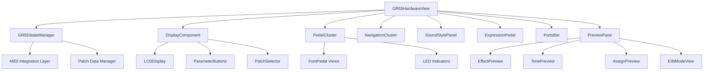

# Design Document

## Overview

This design document outlines the architecture and implementation approach for converting the React Native GR55Controller to SwiftUI. The design maintains visual fidelity and functional behavior while leveraging SwiftUI's declarative patterns, native performance, and iOS integration capabilities.

The conversion follows a component-based architecture where each major hardware section becomes a discrete SwiftUI view. State management uses ObservableObject patterns for reactive updates, and the existing Swift MIDI layer integration remains unchanged to preserve current functionality.

## Architecture

### High-Level Architecture



### SwiftUI View Hierarchy

The main view structure follows SwiftUI's compositional patterns:

```swift
GR55HardwareView {
    VStack {
        PortsBar()

        HStack {
            // Left Section - Main Controls
            VStack {
                HeaderView()

                HStack {
                    // Left Column
                    VStack {
                        DisplayComponent()
                        SoundStylePanel()
                        PedalCluster()
                    }

                    // Right Column
                    NavigationCluster()
                }
            }

            // Right Section - Expression Pedal
            ExpressionPedal()
        }
    }
    .overlay(PreviewPane())
}
```

### State Management Pattern

The design uses SwiftUI's MVVM pattern with ObservableObject for centralized state management:

- **GR55StateManager**: Main ObservableObject containing all hardware state
- **@Published properties**: Trigger automatic UI updates when MIDI data changes
- **@StateObject**: Used in root view for state manager lifecycle
- **@ObservedObject**: Used in child components for state observation
- **@Binding**: Used for two-way data flow between components

## Components and Interfaces

### GR55StateManager (ObservableObject)

The central state management class that replaces the React Native useGR55ControllerState hook:

```swift
@MainActor
class GR55StateManager: ObservableObject {
    // Core State
    @Published var activePedal: Int = 1
    @Published var patchName: String = "LEAD GUITAR"
    @Published var activeStyle: SoundStyle = .lead
    @Published var bank: String = "01-1"

    // MIDI Integration
    @Published var ctlStatus: Bool = false
    @Published var ctlFunction: String = ""
    @Published var expSwStatus: Bool = false
    @Published var expSwFunction: String = ""
    @Published var patchLevel: Int = 100

    // Tone States
    @Published var pcm1Muted: Bool = false
    @Published var pcm2Muted: Bool = false
    @Published var modelMuted: Bool = false
    @Published var normalPuMuted: Bool = false

    // Effect States
    @Published var mfxOn: Bool = true
    @Published var delayOn: Bool = false
    @Published var chorusOn: Bool = true
    // ... other effect states

    // Actions
    func setActivePedal(_ pedal: Int) { }
    func setPatchName(_ name: String) { }
    func setActiveStyle(_ style: SoundStyle) { }
    func toggleCtlPedal() { }
    func toggleExpSw() { }
    func setPatchLevel(_ level: Int) { }

    // Navigation
    func gotoNextBank() { }
    func gotoPrevBank() { }
    func selectOrdinalInCurrentBank(_ ordinal: Int) { }
    func handleDataWheelRotate(_ direction: WheelDirection) { }
    func handleDataWheelPress(_ direction: WheelPressDirection) { }
}
```

### GR55HardwareView (Main Container)

The root SwiftUI view that orchestrates the entire hardware interface:

```swift
struct GR55HardwareView: View {
    @StateObject private var stateManager = GR55StateManager()
    @State private var hoveredItem: HoveredItem? = nil

    var body: some View {
        GeometryReader { geometry in
            ZStack {
                // Main chassis background
                RoundedRectangle(cornerRadius: DesignTokens.Radii.large)
                    .fill(DesignTokens.Colors.chassis)
                    .shadow(color: .black.opacity(0.25), radius: 25, x: 0, y: 12)

                // Hardware layout
                VStack(spacing: DesignTokens.Spacing.large) {
                    PortsBar(guitarOutSource: stateManager.guitarOutSource)

                    HStack(spacing: DesignTokens.Spacing.extraLarge) {
                        // Left section
                        VStack(spacing: DesignTokens.Spacing.large) {
                            HeaderView()

                            HStack(spacing: DesignTokens.Spacing.extraLarge) {
                                // Left column
                                VStack(spacing: DesignTokens.Spacing.medium) {
                                    DisplayComponent(stateManager: stateManager)
                                        .onHover { hoveredItem = $0 }

                                    SoundStylePanel(stateManager: stateManager)

                                    PedalCluster(stateManager: stateManager)
                                }

                                // Right column
                                NavigationCluster(stateManager: stateManager)
                            }
                        }

                        // Right section
                        ExpressionPedal(stateManager: stateManager)
                    }
                }
                .padding(DesignTokens.Spacing.large)
            }
            .overlay(
                PreviewPane(hoveredItem: hoveredItem)
                    .allowsHitTesting(false)
            )
        }
        .background(DesignTokens.Colors.background)
    }
}
```

### DisplayComponent (LCD Interface)

Replicates the LCD display with real-time parameter information:

```swift
struct DisplayComponent: View {
    @ObservedObject var stateManager: GR55StateManager
    @State private var isPickerPresented = false
    @State private var isEditingTempo = false
    @State private var tempoInput = ""

    var body: some View {
        ZStack {
            // LCD bezel and background
            RoundedRectangle(cornerRadius: 8)
                .fill(DesignTokens.Colors.lcdBackground)
                .overlay(
                    RoundedRectangle(cornerRadius: 8)
                        .stroke(DesignTokens.Colors.lcdBorder, lineWidth: 12)
                )
                .shadow(color: .black.opacity(0.1), radius: 4, x: 0, y: 2)

            VStack(spacing: DesignTokens.Spacing.medium) {
                // Status bar with tone sources
                StatusBar(stateManager: stateManager)

                // Main patch information
                HStack(spacing: DesignTokens.Spacing.large) {
                    // Bank display
                    Text(stateManager.bank)
                        .font(DesignTokens.Fonts.bankDisplay)
                        .foregroundColor(DesignTokens.Colors.lcdText)

                    // Patch info
                    VStack(alignment: .leading) {
                        Text(stateManager.activeStyle.rawValue)
                            .font(DesignTokens.Fonts.modeText)
                            .foregroundColor(DesignTokens.Colors.lcdTextMuted)

                        Button(stateManager.patchName) {
                            isPickerPresented = true
                        }
                        .font(DesignTokens.Fonts.patchName)
                        .foregroundColor(DesignTokens.Colors.lcdText)
                    }
                }

                // Parameter controls
                ParameterGrid(stateManager: stateManager)
            }
            .padding(DesignTokens.Spacing.large)
        }
        .sheet(isPresented: $isPickerPresented) {
            PatchSelectorView(stateManager: stateManager)
        }
    }
}
```

### PedalCluster (Foot Pedals)

Interactive foot pedal controls with LED indicators:

```swift
struct PedalCluster: View {
    @ObservedObject var stateManager: GR55StateManager

    var body: some View {
        HStack(spacing: DesignTokens.Spacing.large) {
            ForEach(1...3, id: \.self) { pedalNumber in
                FootPedal(
                    number: pedalNumber,
                    isActive: stateManager.activePedal == pedalNumber,
                    topLabel: stateManager.bankSlots?[pedalNumber - 1]?.name,
                    onSingleTap: { stateManager.selectOrdinalInCurrentBank(pedalNumber) },
                    onDoubleTap: {
                        if pedalNumber == 1 { stateManager.gotoNextBank() }
                        else if pedalNumber == 2 { stateManager.gotoPrevBank() }
                    }
                )
            }

            // CTL Pedal
            FootPedal(
                number: "CTL",
                isActive: stateManager.ctlStatus,
                topLabel: stateManager.ctlFunction,
                onSingleTap: { stateManager.toggleCtlPedal() },
                subLabel: "REC/PLAY/DUB"
            )

            // Audio Player section
            AudioPlayerSection()
        }
    }
}
```

### FootPedal (Individual Pedal)

Custom SwiftUI view for individual foot pedals with 3D appearance:

```swift
struct FootPedal: View {
    let number: Any // Int or String
    let isActive: Bool
    let topLabel: String?
    let onSingleTap: () -> Void
    let onDoubleTap: (() -> Void)?
    let subLabel: String?

    @State private var isPressed = false
    @State private var tapCount = 0

    var body: some View {
        VStack(spacing: DesignTokens.Spacing.small) {
            // Top label
            if let topLabel = topLabel {
                Text(topLabel)
                    .font(DesignTokens.Fonts.pedalTopLabel)
                    .foregroundColor(DesignTokens.Colors.accent)
                    .lineLimit(1)
            }

            // Pedal body
            ZStack {
                // Pedal shape using custom path
                PedalShape()
                    .fill(DesignTokens.Colors.pedalBody)
                    .overlay(
                        PedalShape()
                            .stroke(DesignTokens.Colors.pedalBorder, lineWidth: 2)
                    )
                    .shadow(color: .black.opacity(0.3), radius: 8, x: 0, y: 4)

                // LED indicator
                Circle()
                    .fill(isActive ? DesignTokens.Colors.ledActive : DesignTokens.Colors.ledInactive)
                    .frame(width: 16, height: 16)
                    .shadow(color: isActive ? DesignTokens.Colors.ledActive : .clear, radius: 8)
                    .offset(y: -60)

                // Pedal number
                Text("\(number)")
                    .font(DesignTokens.Fonts.pedalNumber)
                    .foregroundColor(.white)
                    .shadow(color: .black.opacity(0.5), radius: 2)
            }
            .scaleEffect(isPressed ? 0.98 : 1.0)
            .animation(.easeInOut(duration: 0.1), value: isPressed)
            .onTapGesture(count: 2) {
                onDoubleTap?()
            }
            .onTapGesture {
                onSingleTap()
            }
            .onLongPressGesture(minimumDuration: 0, maximumDistance: .infinity, pressing: { pressing in
                isPressed = pressing
            }, perform: {})

            // Sub label
            if let subLabel = subLabel {
                Text(subLabel)
                    .font(DesignTokens.Fonts.pedalSubLabel)
                    .foregroundColor(DesignTokens.Colors.textMuted)
                    .multilineTextAlignment(.center)
            }
        }
    }
}
```

### NavigationCluster (Data Wheel and Controls)

Navigation controls including data wheel and page buttons:

```swift
struct NavigationCluster: View {
    @ObservedObject var stateManager: GR55StateManager

    var body: some View {
        VStack(spacing: DesignTokens.Spacing.large) {
            // Output Level knob
            OutputLevelKnob()

            // Data wheel
            DataWheel(
                onRotate: stateManager.handleDataWheelRotate,
                onPress: stateManager.handleDataWheelPress
            )

            // Navigation buttons
            NavigationButtons()

            // GK controls
            GKControlsRow(stateManager: stateManager)
        }
    }
}
```

### ExpressionPedal (Right Side Pedal)

Large expression pedal with level control:

```swift
struct ExpressionPedal: View {
    @ObservedObject var stateManager: GR55StateManager
    @State private var dragOffset: CGFloat = 0

    var body: some View {
        VStack(spacing: DesignTokens.Spacing.medium) {
            // EXP SW button
            ExpSwButton(stateManager: stateManager)

            // Expression pedal surface
            GeometryReader { geometry in
                ZStack {
                    // Pedal background
                    RoundedRectangle(cornerRadius: 8)
                        .fill(DesignTokens.Colors.expressionPedalBody)
                        .overlay(
                            RoundedRectangle(cornerRadius: 8)
                                .stroke(DesignTokens.Colors.expressionPedalBorder, lineWidth: 2)
                        )

                    // Level overlay
                    VStack {
                        Text("PATCH LEVEL")
                            .font(DesignTokens.Fonts.expressionLabel)
                            .foregroundColor(DesignTokens.Colors.accent)

                        Text("\(stateManager.patchLevel)")
                            .font(DesignTokens.Fonts.expressionValue)
                            .foregroundColor(.white)

                        Spacer()

                        // Level bar
                        LevelBar(level: stateManager.patchLevel)
                    }
                    .padding()
                }
                .gesture(
                    DragGesture()
                        .onChanged { value in
                            let newLevel = Int((1.0 - value.location.y / geometry.size.height) * 100)
                            stateManager.setPatchLevel(max(0, min(100, newLevel)))
                        }
                )
            }
        }
    }
}
```

### PreviewPane (Contextual Information)

Overlay for displaying contextual parameter information:

```swift
struct PreviewPane: View {
    let hoveredItem: HoveredItem?
    @State private var isEditMode = false

    var body: some View {
        Group {
            if let item = hoveredItem {
                VStack {
                    Spacer()

                    HStack {
                        Spacer()

                        PreviewCard(item: item, isEditMode: isEditMode)
                            .frame(maxWidth: 380)

                        Spacer()
                    }

                    Spacer()
                }
                .transition(.opacity.combined(with: .scale))
                .animation(.easeInOut(duration: 0.2), value: hoveredItem)
            }
        }
    }
}
```

## Data Models

### Core Data Structures

```swift
// Main state model
struct GR55State {
    var activePedal: Int
    var patchName: String
    var activeStyle: SoundStyle
    var bank: String
}

// Sound style enumeration
enum SoundStyle: String, CaseIterable {
    case lead = "LEAD"
    case rhythm = "RHYTHM"
    case other = "OTHER"
    case user = "USER"
}

// Bank slot information
struct BankSlot {
    let ordinal: Int
    let name: String
}

// Hovered item for preview
enum HoveredItem {
    case effect(String)
    case tone(String)
    case assign(String)
}

// Data wheel interactions
enum WheelDirection {
    case left, right
}

enum WheelPressDirection {
    case up, down, left, right
}
```

### MIDI Integration Models

```swift
// MIDI parameter mapping
struct MIDIParameter {
    let address: [UInt8]
    let value: UInt8
    let description: String
}

// Patch selection
struct PatchSelection {
    let bankSelectMSB: UInt8
    let pc: UInt8
}

// Remote field binding
@propertyWrapper
struct RemoteField<T> {
    private let keyPath: KeyPath<MIDIState, T>
    private let stateManager: GR55StateManager

    var wrappedValue: T {
        get { stateManager.midiState[keyPath: keyPath] }
        set { stateManager.updateMIDIValue(keyPath, newValue) }
    }
}
```

## Correctness Properties

_A property is a characteristic or behavior that should hold true across all valid executions of a system—essentially, a formal statement about what the system should do. Properties serve as the bridge between human-readable specifications and machine-verifiable correctness guarantees._

### Property 1: Hardware View Layout Consistency

_For any_ iOS device screen size, the Hardware_View should maintain proper component proportions and visual hierarchy with all major sections (Display_Component, Pedal_Cluster, Navigation_Cluster, Sound_Style_Panel, Expression_Pedal, Ports_Bar) visible and correctly positioned
**Validates: Requirements 1.1, 1.4**

### Property 2: State Manager Reactive Updates

_For any_ MIDI data change or user interaction, the State_Manager should update the corresponding @Published properties and trigger appropriate UI updates throughout the interface
**Validates: Requirements 2.2, 2.4, 10.2, 10.3, 10.4**

### Property 3: Display Component State Reflection

_For any_ patch data, tone source state, or effect parameter change, the Display_Component should accurately reflect the current state in its visual elements (patch name, bank, tone sources, effect buttons, assign switches)
**Validates: Requirements 3.2, 3.3, 3.5, 3.6**

### Property 4: Pedal Interaction Behavior

_For any_ pedal tap interaction (single or double), the Pedal_Cluster should execute the correct action (ordinal selection, bank navigation, or CTL toggle) and update the corresponding state and visual indicators
**Validates: Requirements 4.3, 4.4, 4.6**

### Property 5: LED Indicator State Consistency

_For any_ active state change (pedal selection, style selection, switch toggles), the corresponding LED indicators should illuminate with proper visual effects when active and remain dim when inactive
**Validates: Requirements 4.2, 6.2, 7.5**

### Property 6: Navigation Control Responsiveness

_For any_ data wheel rotation or directional press, the Navigation_Cluster should trigger the appropriate navigation action (pedal selection, style navigation) and update the interface state accordingly
**Validates: Requirements 5.2, 5.3**

### Property 7: Expression Pedal Level Control

_For any_ vertical drag gesture on the expression pedal surface, the patch level should update proportionally to the drag position (0-100 range) and the visual level bar should reflect the new value
**Validates: Requirements 7.2, 7.3**

### Property 8: Style Selection Synchronization

_For any_ style button tap, the Sound_Style_Panel should switch to the selected style, update the active LED indicator, and synchronize the patch selection with the new style
**Validates: Requirements 6.3**

### Property 9: Visual Feedback Animations

_For any_ user interaction (button press, pedal tap), the Hardware_View should provide appropriate visual feedback through scale animations and state transitions
**Validates: Requirements 9.1, 9.2, 9.3**

### Property 10: Preview Pane Contextual Display

_For any_ hover interaction over interface elements (effects, tones, assigns), the Preview_Pane should display the correct contextual information for that element type and position itself appropriately without obscuring controls
**Validates: Requirements 12.1, 12.2, 12.3, 12.4, 12.5**

### Property 11: Edit Mode Transition

_For any_ double-tap interaction on effect or parameter buttons, the interface should transition to edit mode and display detailed parameter controls for the selected element
**Validates: Requirements 3.8, 12.8**

### Property 12: Design Token Consistency

_For any_ visual component in the Hardware_View, all styling should use the defined design tokens for colors, spacing, and typography rather than hardcoded values
**Validates: Requirements 1.5, 8.2**

### Property 13: Accessibility and Appearance Mode Support

_For any_ iOS appearance mode (light/dark) and accessibility setting, the Hardware_View should maintain proper contrast ratios and adapt its appearance appropriately
**Validates: Requirements 8.5, 8.6**

### Property 14: MIDI Connection State Handling

_For any_ MIDI connection state change (connected/disconnected), the State_Manager should provide appropriate UI feedback and handle the connection state gracefully without breaking functionality
**Validates: Requirements 10.5**

### Property 15: Gesture Recognition Accuracy

_For any_ touch gesture (tap, double-tap, drag, rotation), the Hardware_View should accurately recognize the gesture type and trigger the appropriate response with proper haptic feedback
**Validates: Requirements 9.4, 9.5**

## Error Handling

### MIDI Communication Errors

- **Connection Loss**: When MIDI connection is lost, display connection status indicator and disable interactive elements gracefully
- **Invalid Data**: When invalid MIDI data is received, log the error and maintain current state without crashing
- **Timeout Handling**: When MIDI commands timeout, provide user feedback and allow retry mechanisms

### User Interaction Errors

- **Invalid Gestures**: When unrecognized gestures occur, ignore them without affecting current state
- **Rapid Interactions**: When users interact too rapidly, queue interactions appropriately to prevent state corruption
- **Boundary Conditions**: When users attempt to navigate beyond valid ranges (banks, levels), clamp values to valid ranges

### State Management Errors

- **State Corruption**: When state becomes invalid, reset to last known good state or default state
- **Memory Pressure**: When memory is low, optimize view updates and release unnecessary resources
- **Threading Issues**: Ensure all UI updates occur on main thread and handle background MIDI updates safely

## Testing Strategy

### Dual Testing Approach

The SwiftUI conversion will use both unit testing and property-based testing to ensure comprehensive coverage:

- **Unit Tests**: Verify specific examples, edge cases, and integration points between SwiftUI components and MIDI layer
- **Property Tests**: Verify universal properties across all inputs using Swift's property-based testing frameworks

### Unit Testing Focus Areas

- Component initialization and lifecycle
- MIDI integration boundary conditions
- Specific user interaction scenarios
- Error handling and recovery
- Accessibility compliance verification

### Property-Based Testing Configuration

- **Framework**: Use Swift Testing with property-based testing extensions or QuickCheck-style libraries
- **Iterations**: Minimum 100 iterations per property test to ensure thorough coverage
- **Test Tagging**: Each property test tagged with format: **Feature: gr55-swiftui-conversion, Property {number}: {property_text}**
- **State Generation**: Smart generators that create valid GR55 states, MIDI data, and user interactions
- **UI Testing**: Property tests for gesture recognition, layout consistency, and state synchronization

### Testing Integration Points

- **MIDI Layer**: Verify seamless integration with existing Swift MIDI communication without breaking current functionality
- **Performance**: Ensure 60fps rendering during normal operation and interactions
- **Memory Management**: Verify proper resource cleanup and efficient view updates
- **Cross-Device**: Test responsive scaling across different iOS device sizes and orientations

## Design Tokens and Styling

### DesignTokens Structure

```swift
enum DesignTokens {
    enum Colors {
        static let background = Color(red: 0.894, green: 0.894, blue: 0.906) // zinc-200
        static let chassis = Color(red: 0.118, green: 0.125, blue: 0.141)
        static let surface = Color(red: 0.145, green: 0.157, blue: 0.180)
        static let border = Color(red: 0.322, green: 0.322, blue: 0.357) // zinc-600
        static let textPrimary = Color(red: 0.957, green: 0.957, blue: 0.961) // zinc-100
        static let textMuted = Color(red: 0.631, green: 0.631, blue: 0.667) // zinc-400
        static let accent = Color(red: 0.976, green: 0.451, blue: 0.086) // orange-500
        static let ledActive = Color(red: 0.937, green: 0.267, blue: 0.267) // red-500
        static let ledInactive = Color(red: 0.094, green: 0.094, blue: 0.106) // zinc-900

        // LCD specific colors
        static let lcdBackground = Color(red: 0.859, green: 0.914, blue: 0.996) // blue-100
        static let lcdBorder = Color(red: 0.153, green: 0.153, blue: 0.169) // zinc-800
        static let lcdText = Color(red: 0.118, green: 0.227, blue: 0.541) // blue-900
        static let lcdTextMuted = Color(red: 0.118, green: 0.227, blue: 0.541, opacity: 0.6)
    }

    enum Spacing {
        static let extraSmall: CGFloat = 4
        static let small: CGFloat = 8
        static let medium: CGFloat = 16
        static let large: CGFloat = 24
        static let extraLarge: CGFloat = 32
    }

    enum Radii {
        static let small: CGFloat = 8
        static let medium: CGFloat = 16
        static let large: CGFloat = 32
    }

    enum Fonts {
        static let bankDisplay = Font.system(size: 60, weight: .black, design: .monospaced)
        static let patchName = Font.system(size: 32, weight: .bold, design: .monospaced)
        static let modeText = Font.system(size: 12, weight: .bold, design: .monospaced)
        static let pedalNumber = Font.system(size: 24, weight: .black)
        static let pedalTopLabel = Font.system(size: 12, weight: .heavy)
        static let pedalSubLabel = Font.system(size: 10, weight: .bold)
        static let expressionLabel = Font.system(size: 10, weight: .heavy)
        static let expressionValue = Font.system(size: 18, weight: .black)
    }

    enum Shadows {
        static let chassis = (color: Color.black.opacity(0.25), radius: CGFloat(25), x: CGFloat(0), y: CGFloat(12))
        static let knob = (color: Color.black.opacity(0.1), radius: CGFloat(4), x: CGFloat(0), y: CGFloat(2))
        static let led = (color: Color.red.opacity(0.8), radius: CGFloat(8), x: CGFloat(0), y: CGFloat(0))
    }
}
```

### Custom Shapes and Paths

```swift
// Trapezoidal pedal shape
struct PedalShape: Shape {
    func path(in rect: CGRect) -> Path {
        var path = Path()

        let topWidth = rect.width * 0.9
        let bottomWidth = rect.width * 0.8
        let height = rect.height

        // Top edge
        path.move(to: CGPoint(x: (rect.width - topWidth) / 2, y: 0))
        path.addLine(to: CGPoint(x: (rect.width + topWidth) / 2, y: 0))

        // Right edge
        path.addLine(to: CGPoint(x: (rect.width + bottomWidth) / 2, y: height))

        // Bottom edge
        path.addLine(to: CGPoint(x: (rect.width - bottomWidth) / 2, y: height))

        // Left edge
        path.closeSubpath()

        return path
    }
}

// Data wheel shape
struct DataWheelShape: Shape {
    func path(in rect: CGRect) -> Path {
        var path = Path()
        path.addEllipse(in: rect)

        // Add notches around the circumference
        let center = CGPoint(x: rect.midX, y: rect.midY)
        let radius = min(rect.width, rect.height) / 2

        for i in 0..<24 {
            let angle = Double(i) * .pi / 12
            let startPoint = CGPoint(
                x: center.x + cos(angle) * (radius - 4),
                y: center.y + sin(angle) * (radius - 4)
            )
            let endPoint = CGPoint(
                x: center.x + cos(angle) * radius,
                y: center.y + sin(angle) * radius
            )

            path.move(to: startPoint)
            path.addLine(to: endPoint)
        }

        return path
    }
}
```

Now I need to use the prework tool to analyze the acceptance criteria before writing the correctness properties section.

<function_calls>
<invoke name="prework">
<parameter name="featureName">gr55-swiftui-conversion
