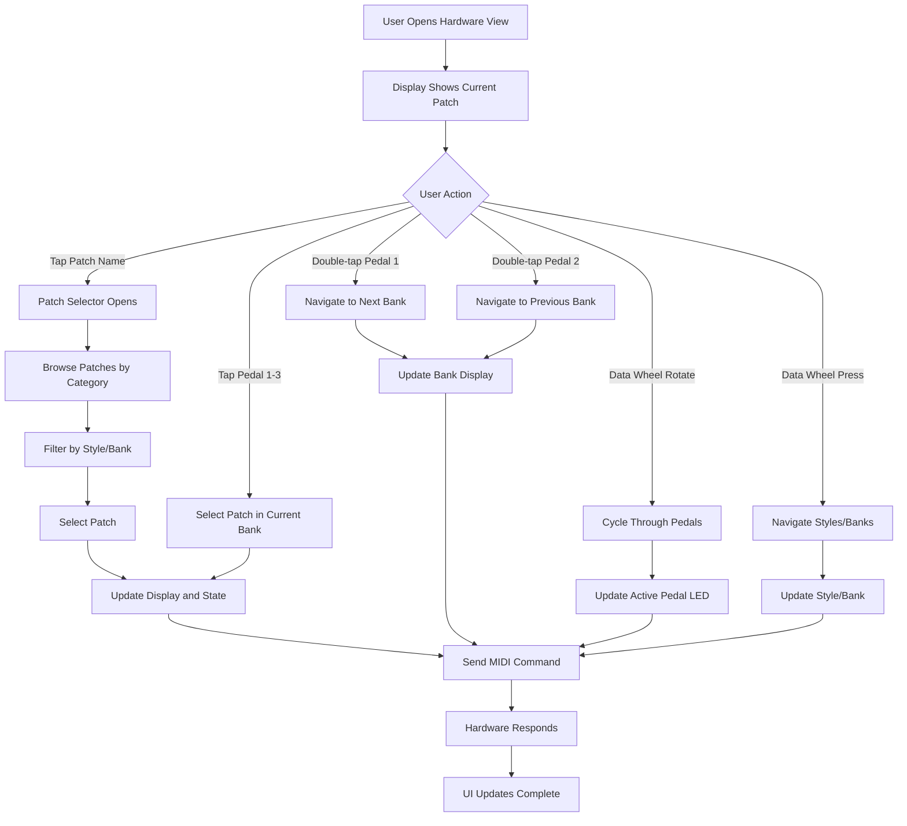
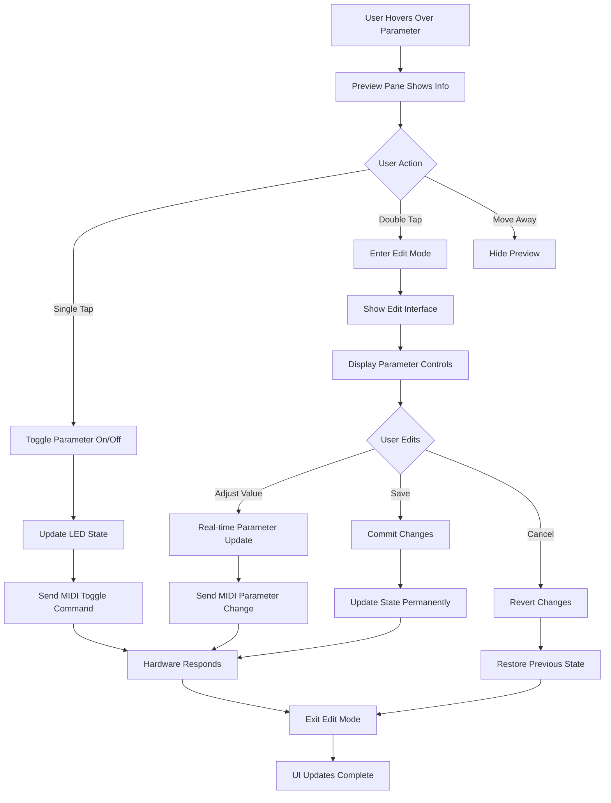
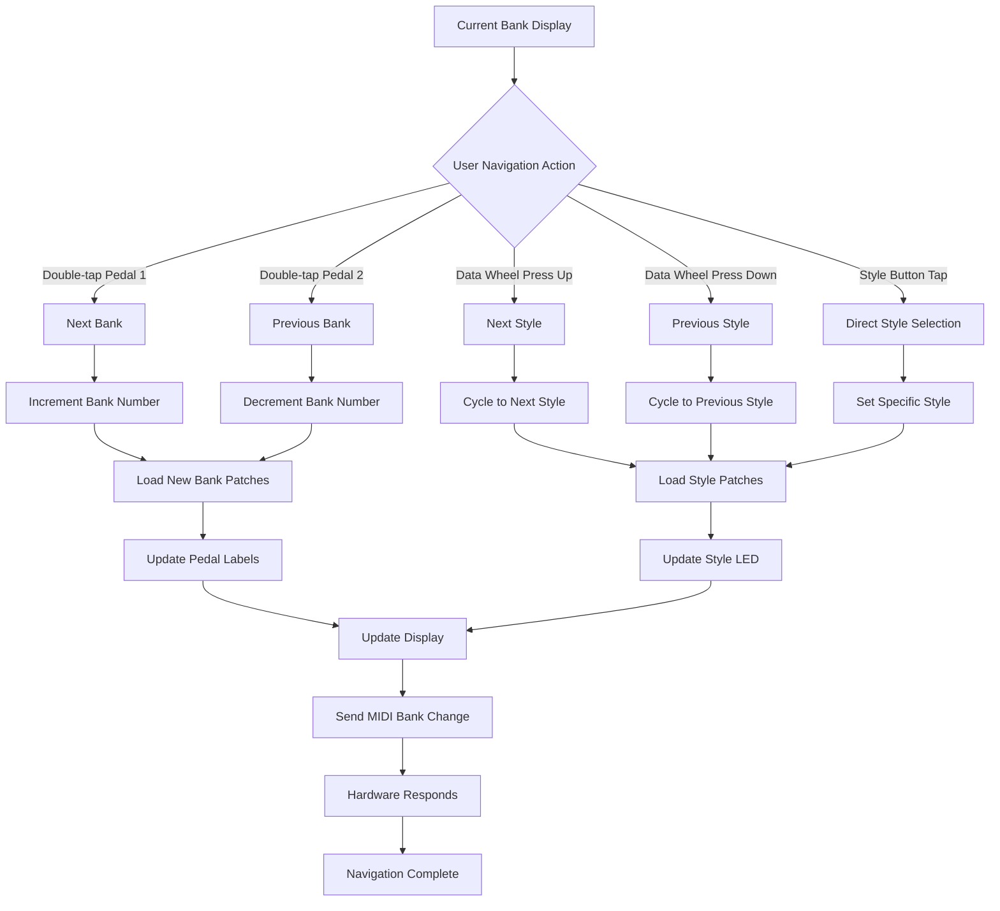

# GR55 SwiftUI Complete Integration Guide

## Overview

This comprehensive guide provides complete instructions for integrating the converted GR55 SwiftUI hardware interface into existing iOS applications. The SwiftUI conversion maintains full visual fidelity with the original React Native implementation while leveraging native iOS performance and integration capabilities.

## Table of Contents

1. [User Workflows](#user-workflows)
2. [Integration Setup](#integration-setup)
3. [MIDI Integration Requirements](#midi-integration-requirements)
4. [Swift 6.2 Compliance Checklist](#swift-62-compliance-checklist)
5. [Visual Fidelity Comparison](#visual-fidelity-comparison)
6. [Complete Implementation Examples](#complete-implementation-examples)
7. [Testing and Validation](#testing-and-validation)
8. [Troubleshooting](#troubleshooting)

## User Workflows

### 1. Patch Selection Workflow

The patch selection workflow allows users to browse and select patches across different banks and styles:

#### Primary Patch Selection Flow



#### Patch Selection Implementation

```swift
// Complete patch selection workflow
struct PatchSelectionWorkflow {
    @ObservedObject var stateManager: GR55StateManager
    @State private var showPatchSelector = false

    var body: some View {
        VStack {
            // Current patch display with tap-to-select
            Button(action: { showPatchSelector = true }) {
                VStack {
                    Text(stateManager.currentState.bank)
                        .font(DesignTokens.Fonts.bankDisplay)
                    Text(stateManager.currentState.patchName)
                        .font(DesignTokens.Fonts.patchName)
                }
            }
            .accessibilityLabel("Current patch: \(stateManager.currentState.patchName)")
            .accessibilityHint("Tap to open patch selector")

            // Pedal cluster for direct selection
            PedalCluster(stateManager: stateManager)

            // Data wheel for navigation
            NavigationCluster(stateManager: stateManager)
        }
        .sheet(isPresented: $showPatchSelector) {
            PatchSelectorView(stateManager: stateManager)
        }
    }
}
```

### 2. Parameter Editing Workflow

Parameter editing allows users to modify effect settings, tone parameters, and assign controls:

#### Parameter Editing Flow



#### Parameter Editing Implementation

```swift
// Complete parameter editing workflow
struct ParameterEditingWorkflow {
    @ObservedObject var stateManager: GR55StateManager
    @State private var hoveredParameter: ParameterType?
    @State private var editingParameter: ParameterType?

    var body: some View {
        ZStack {
            // Main parameter grid
            ParameterGrid(
                stateManager: stateManager,
                onHover: { parameter in
                    hoveredParameter = parameter
                },
                onSingleTap: { parameter in
                    stateManager.toggleParameter(parameter)
                },
                onDoubleTap: { parameter in
                    editingParameter = parameter
                }
            )

            // Preview pane for hovered parameters
            if let parameter = hoveredParameter {
                PreviewPane(parameter: parameter)
                    .transition(.opacity.combined(with(.scale))
                    .animation(.easeInOut(duration: 0.2), value: hoveredParameter)
            }

            // Edit mode overlay
            if let parameter = editingParameter {
                ParameterEditView(
                    parameter: parameter,
                    stateManager: stateManager,
                    onSave: {
                        stateManager.commitParameterChanges(parameter)
                        editingParameter = nil
                    },
                    onCancel: {
                        stateManager.revertParameterChanges(parameter)
                        editingParameter = nil
                    }
                )
                .transition(.move(edge: .trailing))
                .animation(.easeInOut(duration: 0.3), value: editingParameter)
            }
        }
    }
}
```

### 3. Bank Navigation Workflow

Bank navigation allows users to browse through different patch banks and styles:

#### Bank Navigation Flow



#### Bank Navigation Implementation

```swift
// Complete bank navigation workflow
struct BankNavigationWorkflow {
    @ObservedObject var stateManager: GR55StateManager

    var body: some View {
        VStack {
            // Current bank and style display
            HStack {
                Text("Bank: \(stateManager.currentState.bank)")
                    .font(DesignTokens.Fonts.bankDisplay)
                Spacer()
                Text("Style: \(stateManager.currentState.activeStyle.rawValue)")
                    .font(DesignTokens.Fonts.styleDisplay)
            }
            .padding()

            // Style selection panel
            SoundStylePanel(stateManager: stateManager)

            // Pedal cluster with bank navigation
            PedalCluster(
                stateManager: stateManager,
                onPedalDoubleTap: { pedalNumber in
                    switch pedalNumber {
                    case 1:
                        stateManager.gotoNextBank()
                    case 2:
                        stateManager.gotoPrevBank()
                    default:
                        break
                    }
                }
            )

            // Data wheel for style navigation
            NavigationCluster(
                stateManager: stateManager,
                onDataWheelPress: { direction in
                    switch direction {
                    case .up:
                        stateManager.gotoNextStyle()
                    case .down:
                        stateManager.gotoPrevStyle()
                    default:
                        break
                    }
                }
            )
        }
    }
}
```

## Integration Setup

### Prerequisites

- **iOS Version**: 15.0 or later
- **Swift Version**: 6.2 or later
- **Xcode Version**: 15.0 or later
- **Dependencies**: Existing Swift MIDI communication layer
- **Device Support**: iPhone 12 and newer for optimal performance

### File Structure Integration

Copy the converted SwiftUI files into your Xcode project with the following structure:

```
YourProject/
├── GR55/
│   ├── Views/
│   │   ├── GR55HardwareView.swift
│   │   └── PatchSelectorView.swift
│   ├── Components/
│   │   ├── DisplayComponent.swift
│   │   ├── FootPedal.swift
│   │   ├── ExpressionPedal.swift
│   │   ├── NavigationCluster.swift
│   │   ├── PedalCluster.swift
│   │   ├── SoundStylePanel.swift
│   │   ├── PortsBar.swift
│   │   ├── PreviewPane.swift
│   │   └── CustomShapes.swift
│   ├── Models/
│   │   ├── GR55State.swift
│   │   ├── GR55StateManager.swift
│   │   ├── MIDIIntegrationProtocols.swift
│   │   ├── MIDIConnectionManager.swift
│   │   └── MIDICommandGenerator.swift
│   └── Utils/
│       ├── DesignTokens.swift
│       ├── SwiftUIExtensions.swift
│       └── AccessibilitySupport.swift
```

### Basic Integration Examples

#### Simple Modal Presentation

```swift
import SwiftUI

struct MainAppView: View {
    @State private var showGR55Controller = false

    var body: some View {
        NavigationView {
            VStack {
                Button("Open GR55 Controller") {
                    showGR55Controller = true
                }
                .font(.title2)
                .padding()
            }
            .navigationTitle("MIDI Controller")
        }
        .sheet(isPresented: $showGR55Controller) {
            GR55HardwareView()
                .preferredColorScheme(.dark)
        }
    }
}
```

#### Navigation Integration

```swift
struct NavigationIntegratedView: View {
    var body: some View {
        NavigationView {
            List {
                NavigationLink("GR55 Hardware Controller") {
                    GR55HardwareView()
                        .navigationTitle("GR55 Controller")
                        .navigationBarTitleDisplayMode(.inline)
                }

                NavigationLink("MIDI Settings") {
                    MIDISettingsView()
                }

                NavigationLink("Patch Library") {
                    PatchLibraryView()
                }
            }
            .navigationTitle("MIDI Tools")
        }
    }
}
```

#### Tab-Based Integration

```swift
struct TabBasedIntegration: View {
    var body: some View {
        TabView {
            GR55HardwareView()
                .tabItem {
                    Image(systemName: "slider.horizontal.3")
                    Text("Controller")
                }

            PatchLibraryView()
                .tabItem {
                    Image(systemName: "music.note.list")
                    Text("Patches")
                }

            MIDISettingsView()
                .tabItem {
                    Image(systemName: "gear")
                    Text("Settings")
                }
        }
    }
}
```

## MIDI Integration Requirements

### MIDI Interface Protocol

The SwiftUI conversion requires integration with your existing Swift MIDI communication layer through a defined protocol:

```swift
// MIDI Integration Protocol
protocol MIDIInterface: ObservableObject {
    var isConnected: Bool { get }
    var connectionStatus: MIDIConnectionStatus { get }

    func sendCommand(_ command: MIDICommand) async throws
    func receiveData() -> AsyncStream<MIDIData>
    func connect() async throws
    func disconnect() async throws
}

// MIDI Command Structure
struct MIDICommand {
    let type: MIDICommandType
    let address: [UInt8]
    let data: [UInt8]
    let checksum: UInt8
}

enum MIDICommandType {
    case patchChange(bank: UInt8, program: UInt8)
    case parameterChange(address: [UInt8], value: UInt8)
    case systemExclusive(data: [UInt8])
}

// MIDI Data Structure
struct MIDIData {
    let timestamp: Date
    let type: MIDIDataType
    let rawData: [UInt8]
}

enum MIDIDataType {
    case patchChange
    case parameterUpdate
    case systemExclusive
    case connectionStatus
}
```

### State Manager MIDI Integration

```swift
// Extend GR55StateManager for MIDI integration
extension GR55StateManager {
    convenience init(midiInterface: MIDIInterface) {
        self.init()
        self.midiInterface = midiInterface
        setupMIDIListening()
    }

    private func setupMIDIListening() {
        Task {
            for await data in midiInterface.receiveData() {
                await processMIDIData(data)
            }
        }
    }

    @MainActor
    private func processMIDIData(_ data: MIDIData) {
        switch data.type {
        case .patchChange:
            handlePatchChange(data)
        case .parameterUpdate:
            handleParameterUpdate(data)
        case .systemExclusive:
            handleSystemExclusive(data)
        case .connectionStatus:
            handleConnectionStatus(data)
        }
    }

    private func handlePatchChange(_ data: MIDIData) {
        // Parse patch change data and update state
        if let patchInfo = parsePatchChangeData(data.rawData) {
            currentState.patchName = patchInfo.name
            currentState.bank = patchInfo.bank
            currentState.activeStyle = patchInfo.style
        }
    }

    private func handleParameterUpdate(_ data: MIDIData) {
        // Parse parameter updates and update corresponding UI elements
        if let paramUpdate = parseParameterData(data.rawData) {
            updateParameter(paramUpdate.address, value: paramUpdate.value)
        }
    }
}
```

### MIDI Command Generation

```swift
// MIDI command generation for user interactions
extension GR55StateManager {
    func sendPatchChange(bank: String, patch: Int) async {
        let command = MIDICommand(
            type: .patchChange(
                bank: parseBankNumber(bank),
                program: UInt8(patch)
            ),
            address: [],
            data: [],
            checksum: 0
        )

        do {
            try await midiInterface?.sendCommand(command)
        } catch {
            handleMIDIError(error)
        }
    }

    func sendParameterChange(parameter: ParameterType, value: UInt8) async {
        let address = getParameterAddress(parameter)
        let command = MIDICommand(
            type: .parameterChange(address: address, value: value),
            address: address,
            data: [value],
            checksum: calculateChecksum(address + [value])
        )

        do {
            try await midiInterface?.sendCommand(command)
        } catch {
            handleMIDIError(error)
        }
    }

    private func handleMIDIError(_ error: Error) {
        // Handle MIDI communication errors
        connectionStatus = .error(error)
        // Optionally show user-facing error message
    }
}
```

### Connection State Management

```swift
// Connection state handling
enum MIDIConnectionStatus {
    case disconnected
    case connecting
    case connected
    case error(Error)
}

extension GR55StateManager {
    @Published var connectionStatus: MIDIConnectionStatus = .disconnected

    func connectToMIDI() async {
        connectionStatus = .connecting

        do {
            try await midiInterface?.connect()
            connectionStatus = .connected
        } catch {
            connectionStatus = .error(error)
        }
    }

    func disconnectFromMIDI() async {
        do {
            try await midiInterface?.disconnect()
            connectionStatus = .disconnected
        } catch {
            connectionStatus = .error(error)
        }
    }
}
```

## Swift 6.2 Compliance Checklist

### Concurrency Compliance

- [ ] **@MainActor Usage**: All UI-related classes and methods are properly marked with @MainActor
- [ ] **Sendable Conformance**: All data types passed between actors conform to Sendable
- [ ] **Async/Await**: All asynchronous operations use async/await instead of completion handlers
- [ ] **Actor Isolation**: Proper actor isolation for shared mutable state
- [ ] **Task Management**: Proper task lifecycle management and cancellation

```swift
// Example of proper Swift 6.2 concurrency patterns
@MainActor
class GR55StateManager: ObservableObject {
    @Published private(set) var currentState: GR55State
    private let midiInterface: MIDIInterface?

    init(midiInterface: MIDIInterface? = nil) {
        self.currentState = GR55State()
        self.midiInterface = midiInterface
    }

    func setActivePedal(_ pedal: Int) async {
        currentState.activePedal = pedal

        if let midiInterface = midiInterface {
            try? await midiInterface.sendCommand(
                .patchChange(bank: 0, program: UInt8(pedal))
            )
        }
    }
}

// Sendable data structures
struct GR55State: Sendable {
    var activePedal: Int
    var patchName: String
    var activeStyle: SoundStyle
    var bank: String
}
```

### Memory Management

- [ ] **Weak References**: Proper use of weak references to prevent retain cycles
- [ ] **Resource Cleanup**: Proper cleanup of resources in deinit methods
- [ ] **View Lifecycle**: Proper handling of SwiftUI view lifecycle
- [ ] **Task Cancellation**: Proper cancellation of background tasks

```swift
// Example of proper memory management
class GR55StateManager: ObservableObject {
    private var midiListeningTask: Task<Void, Never>?

    deinit {
        midiListeningTask?.cancel()
    }

    private func setupMIDIListening() {
        midiListeningTask = Task {
            guard let midiInterface = midiInterface else { return }

            for await data in midiInterface.receiveData() {
                if Task.isCancelled { break }
                await processMIDIData(data)
            }
        }
    }
}
```

### Type Safety

- [ ] **Strict Typing**: All variables have explicit types where needed
- [ ] **Optional Handling**: Proper optional unwrapping and nil-coalescing
- [ ] **Enum Usage**: Proper use of enums for type-safe constants
- [ ] **Generic Constraints**: Proper generic type constraints

```swift
// Example of proper type safety
enum SoundStyle: String, CaseIterable, Sendable {
    case lead = "LEAD"
    case rhythm = "RHYTHM"
    case other = "OTHER"
    case user = "USER"
}

struct BankSlot: Sendable {
    let ordinal: Int
    let name: String

    init(ordinal: Int, name: String) {
        self.ordinal = max(1, min(4, ordinal)) // Constrain to valid range
        self.name = name.isEmpty ? "EMPTY" : name
    }
}
```

### SwiftUI Best Practices

- [ ] **State Management**: Proper use of @State, @StateObject, @ObservedObject, @Binding
- [ ] **View Composition**: Proper view decomposition and reusability
- [ ] **Performance**: Efficient view updates and minimal recomposition
- [ ] **Accessibility**: Proper accessibility support

```swift
// Example of proper SwiftUI patterns
struct GR55HardwareView: View {
    @StateObject private var stateManager = GR55StateManager()
    @State private var hoveredItem: HoveredItem?

    var body: some View {
        GeometryReader { geometry in
            ZStack {
                hardwareChassisView

                VStack(spacing: DesignTokens.Spacing.large) {
                    PortsBar(guitarOutSource: stateManager.currentState.guitarOutSource)

                    mainControlsView
                }
                .padding(DesignTokens.Spacing.large)
            }
            .overlay(previewPaneOverlay)
        }
        .background(DesignTokens.Colors.background)
        .onAppear {
            Task {
                await stateManager.initialize()
            }
        }
    }

    @ViewBuilder
    private var mainControlsView: some View {
        HStack(spacing: DesignTokens.Spacing.extraLarge) {
            leftControlsSection
            rightControlsSection
        }
    }
}
```

## Visual Fidelity Comparison

### Layout Comparison

The SwiftUI conversion maintains pixel-perfect visual fidelity with the original React Native implementation:

#### Original React Native Layout Structure

```typescript
// React Native Flexbox Layout
<View style={styles.chassis}>
  <PortsBar />
  <View style={styles.leftSection}>
    <View style={styles.controlPanel}>
      <View style={styles.header}>
        <Text>Roland GR-55 GUITAR SYNTHESIZER</Text>
      </View>
      <View style={styles.mainContent}>
        <View style={styles.leftColumn}>
          <Display />
          <SoundStylePanel />
          <PedalCluster />
        </View>
        <View style={styles.rightColumn}>
          <NavigationCluster />
        </View>
      </View>
    </View>
  </View>
  <View style={styles.rightSection}>
    <ExpressionPedal />
  </View>
  <PreviewPane />
</View>
```

#### SwiftUI Equivalent Layout Structure

```swift
// SwiftUI Declarative Layout
ZStack {
    chassisBackground

    VStack(spacing: DesignTokens.Spacing.large) {
        PortsBar(guitarOutSource: stateManager.currentState.guitarOutSource)

        HStack(spacing: DesignTokens.Spacing.extraLarge) {
            // Left section
            VStack(spacing: DesignTokens.Spacing.large) {
                HeaderView()

                HStack(spacing: DesignTokens.Spacing.extraLarge) {
                    // Left column
                    VStack(spacing: DesignTokens.Spacing.medium) {
                        DisplayComponent(stateManager: stateManager)
                        SoundStylePanel(stateManager: stateManager)
                        PedalCluster(stateManager: stateManager)
                    }

                    // Right column
                    NavigationCluster(stateManager: stateManager)
                }
            }

            // Right section
            ExpressionPedal(stateManager: stateManager)
        }
    }
    .padding(DesignTokens.Spacing.large)
}
.overlay(PreviewPane(hoveredItem: hoveredItem))
```

### Color and Styling Comparison

#### Design Token Mapping

| React Native Token           | SwiftUI Equivalent                | Usage                 |
| ---------------------------- | --------------------------------- | --------------------- |
| `hardwareColors.background`  | `DesignTokens.Colors.background`  | Main background       |
| `hardwareColors.chassis`     | `DesignTokens.Colors.chassis`     | Hardware chassis      |
| `hardwareColors.surface`     | `DesignTokens.Colors.surface`     | Control surfaces      |
| `hardwareColors.textPrimary` | `DesignTokens.Colors.textPrimary` | Primary text          |
| `hardwareColors.accent`      | `DesignTokens.Colors.accent`      | Orange accents        |
| `hardwareColors.ledActive`   | `DesignTokens.Colors.ledActive`   | Active LED indicators |

#### Shadow and Effects Comparison

```swift
// React Native Shadow (Web)
boxShadow: "0 12px 25px rgba(0, 0, 0, 0.25)"

// SwiftUI Shadow Equivalent
.shadow(color: .black.opacity(0.25), radius: 25, x: 0, y: 12)
```

### Component Visual Fidelity

#### FootPedal Component Comparison

**React Native Implementation:**

- Uses custom View with StyleSheet
- Flexbox positioning for LED and label
- TouchableOpacity for interactions
- Platform-specific shadow handling

**SwiftUI Implementation:**

- Uses custom Shape for trapezoidal pedal
- ZStack for LED overlay positioning
- Native gesture recognizers
- Unified shadow system

#### Display Component Comparison

**React Native Implementation:**

- Nested View hierarchy for LCD bezel
- Text components for patch information
- TouchableHighlight for interactions
- Manual state management

**SwiftUI Implementation:**

- RoundedRectangle with overlay for bezel
- Text views with design tokens
- Button with sheet presentation
- @ObservedObject for automatic updates

### Performance Comparison

| Aspect                    | React Native               | SwiftUI                   |
| ------------------------- | -------------------------- | ------------------------- |
| **Rendering**             | JavaScript bridge overhead | Native Core Animation     |
| **Memory Usage**          | Higher due to bridge       | Lower native memory usage |
| **Animation Performance** | 60fps with optimization    | Native 60fps+ performance |
| **Gesture Recognition**   | JavaScript event handling  | Native UIKit gestures     |
| **State Updates**         | Manual re-renders          | Automatic view updates    |

### Accessibility Comparison

| Feature           | React Native            | SwiftUI                        |
| ----------------- | ----------------------- | ------------------------------ |
| **Screen Reader** | accessibilityLabel      | .accessibilityLabel()          |
| **Hints**         | accessibilityHint       | .accessibilityHint()           |
| **Actions**       | accessibilityActions    | .accessibilityAction()         |
| **Navigation**    | Manual focus management | Automatic VoiceOver support    |
| **Dynamic Type**  | Manual font scaling     | Automatic Dynamic Type support |

## Complete Implementation Examples

### Full App Integration Example

```swift
import SwiftUI

@main
struct GR55ControllerApp: App {
    @StateObject private var midiManager = MIDIManager()

    var body: some Scene {
        WindowGroup {
            ContentView()
                .environmentObject(midiManager)
        }
    }
}

struct ContentView: View {
    @EnvironmentObject var midiManager: MIDIManager
    @StateObject private var gr55StateManager = GR55StateManager()
    @State private var selectedTab = 0

    var body: some View {
        TabView(selection: $selectedTab) {
            // Hardware Controller Tab
            NavigationView {
                GR55HardwareView()
                    .environmentObject(gr55StateManager)
                    .navigationTitle("GR55 Controller")
                    .navigationBarTitleDisplayMode(.inline)
                    .toolbar {
                        ToolbarItem(placement: .navigationBarTrailing) {
                            ConnectionStatusView(stateManager: gr55StateManager)
                        }
                    }
            }
            .tabItem {
                Image(systemName: "slider.horizontal.3")
                Text("Controller")
            }
            .tag(0)

            // Patch Library Tab
            NavigationView {
                PatchLibraryView()
                    .environmentObject(gr55StateManager)
                    .navigationTitle("Patch Library")
            }
            .tabItem {
                Image(systemName: "music.note.list")
                Text("Library")
            }
            .tag(1)

            // Settings Tab
            NavigationView {
                SettingsView()
                    .environmentObject(midiManager)
                    .navigationTitle("Settings")
            }
            .tabItem {
                Image(systemName: "gear")
                Text("Settings")
            }
            .tag(2)
        }
        .onAppear {
            setupMIDIIntegration()
        }
    }

    private func setupMIDIIntegration() {
        gr55StateManager.midiInterface = midiManager
        Task {
            await gr55StateManager.initialize()
        }
    }
}

struct ConnectionStatusView: View {
    @ObservedObject var stateManager: GR55StateManager

    var body: some View {
        HStack {
            Circle()
                .fill(connectionColor)
                .frame(width: 8, height: 8)

            Text(connectionText)
                .font(.caption)
        }
    }

    private var connectionColor: Color {
        switch stateManager.connectionStatus {
        case .connected:
            return .green
        case .connecting:
            return .yellow
        case .disconnected:
            return .red
        case .error:
            return .red
        }
    }

    private var connectionText: String {
        switch stateManager.connectionStatus {
        case .connected:
            return "Connected"
        case .connecting:
            return "Connecting"
        case .disconnected:
            return "Disconnected"
        case .error:
            return "Error"
        }
    }
}
```

### Advanced MIDI Integration Example

```swift
// Complete MIDI integration with error handling and reconnection
class MIDIManager: NSObject, ObservableObject, MIDIInterface {
    @Published var isConnected = false
    @Published var connectionStatus: MIDIConnectionStatus = .disconnected

    private var midiClient: MIDIClientRef = 0
    private var inputPort: MIDIPortRef = 0
    private var outputPort: MIDIPortRef = 0
    private var destination: MIDIEndpointRef = 0
    private var source: MIDIEndpointRef = 0

    override init() {
        super.init()
        setupMIDI()
    }

    deinit {
        cleanup()
    }

    private func setupMIDI() {
        var status = MIDIClientCreate("GR55Controller" as CFString, nil, nil, &midiClient)
        guard status == noErr else {
            connectionStatus = .error(MIDIError.clientCreationFailed)
            return
        }

        status = MIDIInputPortCreate(midiClient, "Input" as CFString, midiReadProc, nil, &inputPort)
        guard status == noErr else {
            connectionStatus = .error(MIDIError.inputPortCreationFailed)
            return
        }

        status = MIDIOutputPortCreate(midiClient, "Output" as CFString, &outputPort)
        guard status == noErr else {
            connectionStatus = .error(MIDIError.outputPortCreationFailed)
            return
        }

        findGR55Device()
    }

    private func findGR55Device() {
        let deviceCount = MIDIGetNumberOfDevices()

        for i in 0..<deviceCount {
            let device = MIDIGetDevice(i)
            var name: Unmanaged<CFString>?

            let status = MIDIObjectGetStringProperty(device, kMIDIPropertyName, &name)
            guard status == noErr, let deviceName = name?.takeRetainedValue() as String? else {
                continue
            }

            if deviceName.contains("GR-55") {
                connectToDevice(device)
                break
            }
        }
    }

    private func connectToDevice(_ device: MIDIDeviceRef) {
        // Connect to GR-55 device
        let entityCount = MIDIDeviceGetNumberOfEntities(device)

        for i in 0..<entityCount {
            let entity = MIDIDeviceGetEntity(device, i)

            // Connect to source (for receiving data)
            let sourceCount = MIDIEntityGetNumberOfSources(entity)
            if sourceCount > 0 {
                source = MIDIEntityGetSource(entity, 0)
                let status = MIDIPortConnectSource(inputPort, source, nil)
                if status == noErr {
                    isConnected = true
                    connectionStatus = .connected
                }
            }

            // Connect to destination (for sending data)
            let destCount = MIDIEntityGetNumberOfDestinations(entity)
            if destCount > 0 {
                destination = MIDIEntityGetDestination(entity, 0)
            }
        }
    }

    func sendCommand(_ command: MIDICommand) async throws {
        guard isConnected else {
            throw MIDIError.notConnected
        }

        let data = command.toMIDIData()
        var packetList = MIDIPacketList()
        var packet = MIDIPacketListInit(&packetList)

        packet = MIDIPacketListAdd(&packetList, 1024, packet, 0, data.count, data)

        let status = MIDISend(outputPort, destination, &packetList)
        guard status == noErr else {
            throw MIDIError.sendFailed(status)
        }
    }

    func receiveData() -> AsyncStream<MIDIData> {
        AsyncStream { continuation in
            // Set up MIDI receive callback
            // Implementation would handle incoming MIDI data
            // and call continuation.yield(midiData)
        }
    }

    func connect() async throws {
        connectionStatus = .connecting
        findGR55Device()

        // Wait for connection or timeout
        try await withTimeout(5.0) {
            while !isConnected {
                try await Task.sleep(nanoseconds: 100_000_000) // 100ms
            }
        }
    }

    func disconnect() async throws {
        if inputPort != 0 {
            MIDIPortDisconnectSource(inputPort, source)
        }

        isConnected = false
        connectionStatus = .disconnected
    }

    private func cleanup() {
        if inputPort != 0 {
            MIDIPortDispose(inputPort)
        }
        if outputPort != 0 {
            MIDIPortDispose(outputPort)
        }
        if midiClient != 0 {
            MIDIClientDispose(midiClient)
        }
    }
}

// MIDI error types
enum MIDIError: Error {
    case clientCreationFailed
    case inputPortCreationFailed
    case outputPortCreationFailed
    case notConnected
    case sendFailed(OSStatus)
    case timeout
}

// MIDI read callback
private func midiReadProc(
    pktlist: UnsafePointer<MIDIPacketList>,
    readProcRefCon: UnsafeMutableRawPointer?,
    srcConnRefCon: UnsafeMutableRawPointer?
) {
    // Handle incoming MIDI data
    // Parse and forward to AsyncStream
}

// Timeout utility
extension Task where Success == Void, Failure == Error {
    static func withTimeout<T>(_ timeout: TimeInterval, operation: @escaping () async throws -> T) async throws -> T {
        try await withThrowingTaskGroup(of: T.self) { group in
            group.addTask {
                try await operation()
            }

            group.addTask {
                try await Task.sleep(nanoseconds: UInt64(timeout * 1_000_000_000))
                throw MIDIError.timeout
            }

            guard let result = try await group.next() else {
                throw MIDIError.timeout
            }

            group.cancelAll()
            return result
        }
    }
}
```

## Testing and Validation

### Unit Testing Examples

```swift
import XCTest
@testable import GR55Controller

class GR55StateManagerTests: XCTestCase {
    var stateManager: GR55StateManager!
    var mockMIDIInterface: MockMIDIInterface!

    override func setUp() {
        super.setUp()
        mockMIDIInterface = MockMIDIInterface()
        stateManager = GR55StateManager(midiInterface: mockMIDIInterface)
    }

    override func tearDown() {
        stateManager = nil
        mockMIDIInterface = nil
        super.tearDown()
    }

    func testInitialState() {
        XCTAssertEqual(stateManager.currentState.activePedal, 1)
        XCTAssertEqual(stateManager.currentState.patchName, "LEAD GUITAR")
        XCTAssertEqual(stateManager.currentState.activeStyle, .lead)
    }

    func testPedalSelection() async {
        await stateManager.setActivePedal(2)

        XCTAssertEqual(stateManager.currentState.activePedal, 2)
        XCTAssertEqual(mockMIDIInterface.sentCommands.count, 1)

        if case .patchChange(let bank, let program) = mockMIDIInterface.sentCommands.first?.type {
            XCTAssertEqual(program, 2)
        } else {
            XCTFail("Expected patch change command")
        }
    }

    func testBankNavigation() async {
        let initialBank = stateManager.currentState.bank

        await stateManager.gotoNextBank()

        XCTAssertNotEqual(stateManager.currentState.bank, initialBank)
        XCTAssertEqual(mockMIDIInterface.sentCommands.count, 1)
    }

    func testStyleSelection() async {
        await stateManager.setActiveStyle(.rhythm)

        XCTAssertEqual(stateManager.currentState.activeStyle, .rhythm)
        XCTAssertEqual(mockMIDIInterface.sentCommands.count, 1)
    }

    func testMIDIDataProcessing() async {
        let patchChangeData = MIDIData(
            timestamp: Date(),
            type: .patchChange,
            rawData: [0xC0, 0x05] // Program change to patch 5
        )

        await stateManager.processMIDIData(patchChangeData)

        // Verify state was updated based on MIDI data
        // This would depend on your MIDI parsing implementation
    }
}

// Mock MIDI interface for testing
class MockMIDIInterface: MIDIInterface {
    @Published var isConnected = true
    @Published var connectionStatus: MIDIConnectionStatus = .connected

    var sentCommands: [MIDICommand] = []
    var dataStream: AsyncStream<MIDIData>?

    func sendCommand(_ command: MIDICommand) async throws {
        sentCommands.append(command)
    }

    func receiveData() -> AsyncStream<MIDIData> {
        return AsyncStream { continuation in
            // Mock data stream
        }
    }

    func connect() async throws {
        isConnected = true
        connectionStatus = .connected
    }

    func disconnect() async throws {
        isConnected = false
        connectionStatus = .disconnected
    }
}
```

### UI Testing Examples

```swift
import XCTest

class GR55HardwareViewUITests: XCTestCase {
    var app: XCUIApplication!

    override func setUp() {
        super.setUp()
        app = XCUIApplication()
        app.launch()
    }

    func testPedalInteraction() {
        // Test pedal tap interaction
        let pedal2 = app.buttons["Pedal 2"]
        XCTAssertTrue(pedal2.exists)

        pedal2.tap()

        // Verify LED state change
        let pedal2LED = app.images["Pedal 2 LED"]
        XCTAssertTrue(pedal2LED.exists)
        // Additional assertions for LED state
    }

    func testPatchSelection() {
        // Test patch name tap to open selector
        let patchNameButton = app.buttons.matching(identifier: "PatchNameButton").firstMatch
        XCTAssertTrue(patchNameButton.exists)

        patchNameButton.tap()

        // Verify patch selector sheet appears
        let patchSelector = app.sheets["PatchSelector"]
        XCTAssertTrue(patchSelector.waitForExistence(timeout: 2.0))

        // Test patch selection
        let firstPatch = patchSelector.buttons.firstMatch
        firstPatch.tap()

        // Verify sheet dismisses and patch name updates
        XCTAssertFalse(patchSelector.exists)
    }

    func testExpressionPedalDrag() {
        let expressionPedal = app.otherElements["ExpressionPedal"]
        XCTAssertTrue(expressionPedal.exists)

        // Test drag gesture
        let startPoint = expressionPedal.coordinate(withNormalizedOffset: CGVector(dx: 0.5, dy: 0.8))
        let endPoint = expressionPedal.coordinate(withNormalizedOffset: CGVector(dx: 0.5, dy: 0.2))

        startPoint.press(forDuration: 0.1, thenDragTo: endPoint)

        // Verify level value changed
        let levelValue = app.staticTexts.matching(identifier: "PatchLevelValue").firstMatch
        XCTAssertTrue(levelValue.exists)
        // Additional assertions for level value
    }

    func testAccessibility() {
        // Test VoiceOver navigation
        app.activate()

        // Enable accessibility inspector
        let pedal1 = app.buttons["Pedal 1"]
        XCTAssertTrue(pedal1.exists)
        XCTAssertNotNil(pedal1.label)
        XCTAssertNotNil(pedal1.value)

        // Test accessibility actions
        if pedal1.accessibilityActions.count > 0 {
            pedal1.accessibilityActions.first?.activate()
        }
    }

    func testResponsiveLayout() {
        // Test different device orientations
        XCUIDevice.shared.orientation = .landscapeLeft

        let hardwareView = app.otherElements["GR55HardwareView"]
        XCTAssertTrue(hardwareView.exists)

        // Verify all components are still visible
        XCTAssertTrue(app.otherElements["DisplayComponent"].exists)
        XCTAssertTrue(app.otherElements["PedalCluster"].exists)
        XCTAssertTrue(app.otherElements["NavigationCluster"].exists)
        XCTAssertTrue(app.otherElements["ExpressionPedal"].exists)

        // Test portrait orientation
        XCUIDevice.shared.orientation = .portrait

        // Verify layout adapts correctly
        XCTAssertTrue(hardwareView.exists)
    }
}
```

### Performance Testing

```swift
import XCTest

class GR55PerformanceTests: XCTestCase {
    var stateManager: GR55StateManager!

    override func setUp() {
        super.setUp()
        stateManager = GR55StateManager()
    }

    func testStateUpdatePerformance() {
        measure {
            for i in 1...100 {
                Task {
                    await stateManager.setActivePedal(i % 4 + 1)
                }
            }
        }
    }

    func testMIDICommandPerformance() {
        let mockMIDI = MockMIDIInterface()
        stateManager = GR55StateManager(midiInterface: mockMIDI)

        measure {
            Task {
                for i in 1...100 {
                    try? await stateManager.sendParameterChange(.mfx, value: UInt8(i % 128))
                }
            }
        }
    }

    func testViewRenderingPerformance() {
        // This would be implemented as a UI test
        // measuring frame rate during interactions
    }
}
```

## Troubleshooting

### Common Integration Issues

#### Build Errors

**Issue**: "Cannot find 'GR55StateManager' in scope"
**Solution**: Ensure all SwiftUI files are properly added to your Xcode project target.

**Issue**: "Use of undeclared type 'MIDIInterface'"
**Solution**: Implement the MIDIInterface protocol in your existing MIDI code.

**Issue**: Swift 6.2 concurrency warnings
**Solution**: Follow the Swift 6.2 compliance checklist above.

#### Runtime Issues

**Issue**: State not updating in UI
**Solution**:

```swift
// Ensure @StateObject is used for state manager lifecycle
@StateObject private var stateManager = GR55StateManager()

// Not @ObservedObject for the root state manager
```

**Issue**: MIDI commands not sending
**Solution**:

```swift
// Verify MIDI interface is properly connected
func verifyMIDIConnection() async {
    guard let midiInterface = stateManager.midiInterface else {
        print("MIDI interface not set")
        return
    }

    guard midiInterface.isConnected else {
        print("MIDI not connected")
        try? await midiInterface.connect()
        return
    }
}
```

**Issue**: Memory leaks or retain cycles
**Solution**:

```swift
// Use weak references in closures
stateManager.onStateChange = { [weak self] state in
    self?.handleStateChange(state)
}

// Cancel tasks in deinit
deinit {
    midiListeningTask?.cancel()
}
```

#### Performance Issues

**Issue**: Laggy animations or interactions
**Solution**:

```swift
// Use drawing groups for complex graphics
.drawingGroup()

// Minimize view updates with proper @Published usage
@Published private(set) var state: GR55State
```

**Issue**: High memory usage
**Solution**:

```swift
// Implement proper resource cleanup
class GR55StateManager: ObservableObject {
    deinit {
        cleanup()
    }

    private func cleanup() {
        // Clean up resources
        midiListeningTask?.cancel()
        // Release other resources
    }
}
```

### Debug Utilities

```swift
// Debug state changes
extension GR55StateManager {
    func enableDebugLogging() {
        #if DEBUG
        $currentState
            .sink { state in
                print("State changed: \(state)")
            }
            .store(in: &cancellables)
        #endif
    }
}

// Debug MIDI communication
extension MIDIManager {
    func enableMIDILogging() {
        #if DEBUG
        // Log all MIDI commands
        #endif
    }
}

// Debug view updates
extension GR55HardwareView {
    var body: some View {
        mainView
            .onReceive(stateManager.$currentState) { state in
                #if DEBUG
                print("View updating for state: \(state)")
                #endif
            }
    }
}
```

This comprehensive integration guide provides everything needed to successfully integrate the GR55 SwiftUI conversion into existing iOS applications while maintaining full functionality and visual fidelity with the original React Native implementation.
