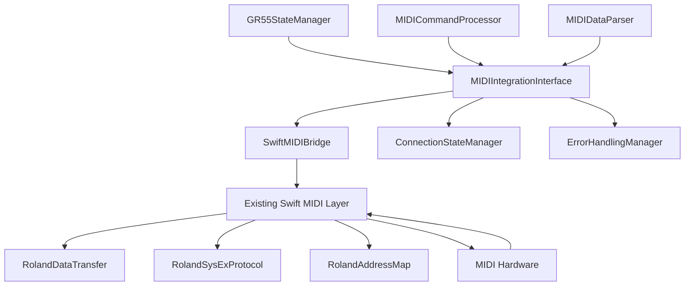

# MIDI Communication Integration Interface Design

## Overview

This document defines the interface design for connecting the SwiftUI GR55StateManager to the existing Swift MIDI communication system. The design maintains compatibility with the current MIDI layer while providing a clean, async/await-based interface that follows Swift 6.2 concurrency patterns.

## Architecture Overview



## Core Interface Protocols

### MIDIIntegrationInterface

The main protocol that defines the interface between the SwiftUI state manager and the MIDI system:

```swift
@MainActor
protocol MIDIIntegrationInterface: Sendable {
    /// Sends a MIDI command asynchronously
    func sendMIDICommand(_ command: MIDICommand) async throws

    /// Receives MIDI data as an async stream
    func receiveMIDIData() -> AsyncStream<MIDIDataUpdate>

    /// Checks if MIDI connection is active
    var isConnected: Bool { get async }

    /// Connection state changes
    var connectionState: AsyncStream<MIDIConnectionState> { get }

    /// Synchronizes current state with hardware
    func synchronizeWithHardware() async throws

    /// Requests current patch data from hardware
    func requestCurrentPatchData() async throws -> PatchData
}
```

### MIDICommandProcessor

Handles the conversion of high-level commands to MIDI data:

```swift
protocol MIDICommandProcessor: Sendable {
    /// Converts a MIDICommand to raw MIDI data
    func processMIDICommand(_ command: MIDICommand) async throws -> Data

    /// Validates command before processing
    func validateCommand(_ command: MIDICommand) -> Bool

    /// Gets the expected response addresses for a command
    func getExpectedResponseAddresses(for command: MIDICommand) -> [UInt32]
}
```

### MIDIDataParser

Handles parsing of incoming MIDI data into state updates:

```swift
protocol MIDIDataParser: Sendable {
    /// Parses raw MIDI data into state updates
    func parseMIDIData(_ data: Data) async throws -> [MIDIDataUpdate]

    /// Validates incoming MIDI data
    func validateMIDIData(_ data: Data) -> Bool

    /// Extracts patch information from MIDI data
    func extractPatchInfo(from data: Data) async throws -> PatchInfo?
}
```

## Data Types

### MIDICommand

Represents all possible MIDI commands for the GR-55:

```swift
enum MIDICommand: Sendable {
    // Pedal and navigation commands
    case pedalSelection(Int)
    case bankNavigation(BankNavigationCommand)
    case dataWheelRotation(WheelDirection)
    case dataWheelPress(WheelPressDirection)

    // Switch and control commands
    case ctlToggle(Bool)
    case expSwToggle(Bool)
    case assignToggle(assignNumber: Int, isOn: Bool)

    // Patch and level commands
    case patchSelection(PatchSelection)
    case patchLevelChange(Int)
    case styleChange(SoundStyle)

    // Effect commands
    case effectToggle(effectName: String, isOn: Bool)
    case toneSourceToggle(toneName: String, isMuted: Bool)

    // System commands
    case requestPatchData
    case requestSystemData
    case saveUserPatch(userPatchNumber: Int)

    /// Gets the MIDI address for this command
    var midiAddress: [UInt8] {
        switch self {
        case .pedalSelection:
            return [0x18, 0x00, 0x00, 0x00] // Temporary patch common
        case .patchLevelChange:
            return [0x18, 0x00, 0x00, 0x07] // Patch level address
        case .ctlToggle:
            return [0x18, 0x00, 0x00, 0x15] // CTL status address
        case .expSwToggle:
            return [0x18, 0x00, 0x00, 0x17] // EXP SW status address
        case .effectToggle(let effectName, _):
            return getEffectAddress(effectName)
        case .toneSourceToggle(let toneName, _):
            return getToneSourceAddress(toneName)
        case .assignToggle(let assignNumber, _):
            return getAssignAddress(assignNumber)
        default:
            return [0x18, 0x00, 0x00, 0x00] // Default to common area
        }
    }

    /// Gets the MIDI value for this command
    var midiValue: UInt8 {
        switch self {
        case .pedalSelection(let pedal):
            return UInt8(max(0, min(127, pedal - 1)))
        case .patchLevelChange(let level):
            return UInt8(max(0, min(127, level)))
        case .ctlToggle(let isOn):
            return isOn ? 1 : 0
        case .expSwToggle(let isOn):
            return isOn ? 1 : 0
        case .effectToggle(_, let isOn):
            return isOn ? 1 : 0
        case .toneSourceToggle(_, let isMuted):
            return isMuted ? 0 : 1 // Inverted logic for mute
        case .assignToggle(_, let isOn):
            return isOn ? 1 : 0
        default:
            return 0
        }
    }
}
```

### MIDIDataUpdate

Represents parsed MIDI data updates:

```swift
struct MIDIDataUpdate: Sendable {
    let updateType: MIDIUpdateType
    let address: [UInt8]
    let value: UInt8
    let timestamp: Date

    enum MIDIUpdateType: Sendable {
        case patchChange
        case parameterChange
        case systemChange
        case connectionChange
    }
}
```

### MIDIConnectionState

Represents MIDI connection states:

```swift
enum MIDIConnectionState: Sendable {
    case disconnected
    case connecting
    case connected
    case error(MIDIError)

    var isConnected: Bool {
        if case .connected = self {
            return true
        }
        return false
    }
}
```

### MIDIError

Comprehensive error handling for MIDI operations:

```swift
enum MIDIError: Error, Sendable {
    case connectionLost
    case invalidCommand(String)
    case invalidData(String)
    case timeout
    case hardwareError(String)
    case checksumError
    case addressOutOfRange([UInt8])
    case valueOutOfRange(UInt8)

    var localizedDescription: String {
        switch self {
        case .connectionLost:
            return "MIDI connection lost"
        case .invalidCommand(let command):
            return "Invalid MIDI command: \(command)"
        case .invalidData(let data):
            return "Invalid MIDI data: \(data)"
        case .timeout:
            return "MIDI operation timed out"
        case .hardwareError(let error):
            return "Hardware error: \(error)"
        case .checksumError:
            return "MIDI checksum validation failed"
        case .addressOutOfRange(let address):
            return "MIDI address out of range: \(address)"
        case .valueOutOfRange(let value):
            return "MIDI value out of range: \(value)"
        }
    }
}
```

## Implementation Classes

### SwiftMIDIBridge

The main implementation class that bridges SwiftUI and the existing MIDI layer:

```swift
@MainActor
final class SwiftMIDIBridge: MIDIIntegrationInterface {

    // MARK: - Private Properties
    private let commandProcessor: MIDICommandProcessor
    private let dataParser: MIDIDataParser
    private let connectionManager: ConnectionStateManager
    private let errorHandler: ErrorHandlingManager

    // Integration with existing Swift MIDI layer
    private weak var rolandDataTransfer: RolandDataTransferContext?
    private weak var rolandIoSetup: RolandIoSetupContext?

    // Async streams for data flow
    private let midiDataSubject = PassthroughSubject<MIDIDataUpdate, Never>()
    private let connectionStateSubject = PassthroughSubject<MIDIConnectionState, Never>()

    // MARK: - Initialization
    init(
        commandProcessor: MIDICommandProcessor = DefaultMIDICommandProcessor(),
        dataParser: MIDIDataParser = DefaultMIDIDataParser(),
        connectionManager: ConnectionStateManager = DefaultConnectionStateManager(),
        errorHandler: ErrorHandlingManager = DefaultErrorHandlingManager()
    ) {
        self.commandProcessor = commandProcessor
        self.dataParser = dataParser
        self.connectionManager = connectionManager
        self.errorHandler = errorHandler

        setupMIDIIntegration()
    }

    // MARK: - MIDIIntegrationInterface Implementation
    func sendMIDICommand(_ command: MIDICommand) async throws {
        guard await isConnected else {
            throw MIDIError.connectionLost
        }

        // Validate command
        guard commandProcessor.validateCommand(command) else {
            throw MIDIError.invalidCommand(String(describing: command))
        }

        // Process command to MIDI data
        let midiData = try await commandProcessor.processMIDICommand(command)

        // Send via existing MIDI layer
        try await sendRawMIDIData(midiData)
    }

    func receiveMIDIData() -> AsyncStream<MIDIDataUpdate> {
        return AsyncStream { continuation in
            let cancellable = midiDataSubject.sink { update in
                continuation.yield(update)
            }

            continuation.onTermination = { _ in
                cancellable.cancel()
            }
        }
    }

    var isConnected: Bool {
        get async {
            return await connectionManager.isConnected
        }
    }

    var connectionState: AsyncStream<MIDIConnectionState> {
        return AsyncStream { continuation in
            let cancellable = connectionStateSubject.sink { state in
                continuation.yield(state)
            }

            continuation.onTermination = { _ in
                cancellable.cancel()
            }
        }
    }

    func synchronizeWithHardware() async throws {
        guard await isConnected else {
            throw MIDIError.connectionLost
        }

        // Request current patch data
        let patchData = try await requestCurrentPatchData()

        // Parse and emit updates
        let updates = try await dataParser.parsePatchData(patchData)
        for update in updates {
            midiDataSubject.send(update)
        }
    }

    func requestCurrentPatchData() async throws -> PatchData {
        guard await isConnected else {
            throw MIDIError.connectionLost
        }

        // Use existing MIDI layer to request patch data
        return try await requestPatchDataFromHardware()
    }

    // MARK: - Private Implementation
    private func setupMIDIIntegration() {
        // Set up connection monitoring
        Task {
            await monitorConnection()
        }

        // Set up MIDI data reception
        Task {
            await monitorMIDIData()
        }
    }

    private func sendRawMIDIData(_ data: Data) async throws {
        // Integration point with existing MIDI layer
        // This would use the existing RolandDataTransfer context
        guard let dataTransfer = rolandDataTransfer else {
            throw MIDIError.connectionLost
        }

        // Convert to existing MIDI protocol format and send
        try await sendViaExistingMIDILayer(data, dataTransfer: dataTransfer)
    }

    private func monitorConnection() async {
        // Monitor connection state changes from existing MIDI layer
        // Emit connection state updates
    }

    private func monitorMIDIData() async {
        // Monitor incoming MIDI data from existing layer
        // Parse and emit data updates
    }

    private func requestPatchDataFromHardware() async throws -> PatchData {
        // Use existing MIDI layer to request patch data
        // This would integrate with the existing requestData methods
        fatalError("Implementation required in MIDI integration task")
    }

    private func sendViaExistingMIDILayer(_ data: Data, dataTransfer: RolandDataTransferContext) async throws {
        // Integration with existing setField method
        fatalError("Implementation required in MIDI integration task")
    }
}
```

## Integration with Existing MIDI Layer

### Connection Points

The SwiftMIDIBridge integrates with the existing MIDI layer at these key points:

1. **RolandDataTransferContext**: For sending MIDI commands and receiving data
2. **RolandIoSetupContext**: For connection management and device selection
3. **RolandSysExProtocol**: For MIDI message formatting and parsing
4. **RolandAddressMap**: For address mapping and field definitions

### Data Flow Integration

```swift
// Integration with existing useRemoteField pattern
extension SwiftMIDIBridge {
    /// Creates a binding to an existing remote field
    func bindToRemoteField<T>(
        _ field: FieldReference<FieldType<T>>,
        in context: RolandRemotePageContext
    ) -> AsyncBinding<T> {
        return AsyncBinding(
            get: { [weak self] in
                // Get current value from existing MIDI layer
                return await self?.getCurrentFieldValue(field, context: context) ?? field.definition.type.emptyValue
            },
            set: { [weak self] newValue in
                // Set value via existing MIDI layer
                await self?.setFieldValue(field, value: newValue, context: context)
            }
        )
    }

    private func getCurrentFieldValue<T>(
        _ field: FieldReference<FieldType<T>>,
        context: RolandRemotePageContext
    ) async -> T {
        // Integration with existing remote field system
        fatalError("Implementation required in MIDI integration task")
    }

    private func setFieldValue<T>(
        _ field: FieldReference<FieldType<T>>,
        value: T,
        context: RolandRemotePageContext
    ) async {
        // Integration with existing remote field system
        fatalError("Implementation required in MIDI integration task")
    }
}
```

## Error Handling Strategy

### Connection State Handling

```swift
final class ConnectionStateManager: Sendable {
    private let connectionStateSubject = PassthroughSubject<MIDIConnectionState, Never>()

    func monitorConnection() async {
        // Monitor existing MIDI connection state
        // Emit state changes through connectionStateSubject
    }

    var isConnected: Bool {
        get async {
            // Check existing MIDI layer connection state
            return false // Placeholder
        }
    }

    func handleConnectionLoss() async {
        connectionStateSubject.send(.disconnected)

        // Attempt reconnection with exponential backoff
        await attemptReconnection()
    }

    private func attemptReconnection() async {
        // Reconnection logic using existing MIDI layer
    }
}
```

### Error Recovery

```swift
final class ErrorHandlingManager: Sendable {
    func handleMIDIError(_ error: MIDIError) async {
        switch error {
        case .connectionLost:
            await handleConnectionLoss()
        case .timeout:
            await handleTimeout()
        case .checksumError:
            await handleChecksumError()
        case .hardwareError(let description):
            await handleHardwareError(description)
        default:
            await handleGenericError(error)
        }
    }

    private func handleConnectionLoss() async {
        // Attempt to restore connection
        // Notify user of connection issues
    }

    private func handleTimeout() async {
        // Retry with exponential backoff
        // Log timeout for debugging
    }

    private func handleChecksumError() async {
        // Request data retransmission
        // Log checksum errors for debugging
    }

    private func handleHardwareError(_ description: String) async {
        // Log hardware error
        // Provide user feedback
    }

    private func handleGenericError(_ error: MIDIError) async {
        // Generic error handling
        // Log error for debugging
    }
}
```

## Performance Considerations

### Async/Await Optimization

- All MIDI operations use async/await for Swift 6.2 compliance
- Background processing for MIDI data parsing
- Main actor isolation for UI updates
- Efficient memory management for MIDI data streams

### Throttling and Batching

```swift
extension SwiftMIDIBridge {
    /// Throttles MIDI commands to prevent overwhelming the hardware
    private func throttleMIDICommand(_ command: MIDICommand) async throws {
        // Implement throttling logic similar to existing GAP_BETWEEN_MESSAGES_MS
        let minimumDelay = TimeInterval(0.02) // 20ms like existing implementation

        // Wait for minimum delay between commands
        try await Task.sleep(nanoseconds: UInt64(minimumDelay * 1_000_000_000))
    }

    /// Batches multiple parameter changes for efficient transmission
    func batchParameterChanges(_ changes: [MIDICommand]) async throws {
        for command in changes {
            try await sendMIDICommand(command)
            try await throttleMIDICommand(command)
        }
    }
}
```

## Testing Strategy

### Unit Testing

- Mock implementations of all protocols
- Test MIDI command generation and parsing
- Test error handling and recovery
- Test connection state management

### Integration Testing

- Test with existing MIDI layer components
- Test real hardware communication
- Test error conditions and recovery
- Test performance under load

### Property-Based Testing

- Test MIDI command round-trip consistency
- Test state synchronization properties
- Test error handling robustness
- Test connection state transitions

## Usage Examples

### Basic Integration

```swift
// In GR55StateManager initialization
let midiInterface = SwiftMIDIBridge()
let stateManager = GR55StateManager(midiInterface: midiInterface)

// Set up MIDI data monitoring
Task {
    for await update in midiInterface.receiveMIDIData() {
        await stateManager.processMIDIUpdate(update)
    }
}

// Set up connection monitoring
Task {
    for await connectionState in midiInterface.connectionState {
        await stateManager.handleConnectionStateChange(connectionState)
    }
}
```

### Command Sending

```swift
// In GR55StateManager action methods
func setActivePedal(_ pedal: Int) {
    state.activePedal = pedal

    Task {
        do {
            try await midiInterface?.sendMIDICommand(.pedalSelection(pedal))
        } catch {
            await handleMIDIError(error)
        }
    }
}
```

### State Synchronization

```swift
// Synchronize with hardware on app launch
func synchronizeWithHardware() async {
    do {
        try await midiInterface?.synchronizeWithHardware()
    } catch {
        await handleMIDIError(error)
    }
}
```

## Future Enhancements

### Advanced Features

- MIDI learn functionality for custom mappings
- Patch backup and restore capabilities
- Real-time parameter automation
- Multi-device support for multiple GR-55 units

### Performance Optimizations

- MIDI data compression for large transfers
- Predictive caching of patch data
- Background synchronization
- Optimized memory usage for long-running sessions

## Conclusion

This MIDI integration interface design provides a clean, modern Swift 6.2-compliant bridge between the SwiftUI GR55StateManager and the existing MIDI communication layer. The design maintains compatibility with existing patterns while providing improved error handling, connection management, and async/await support for better performance and reliability.

The interface is designed to be implemented incrementally, allowing for gradual migration from the existing React Native patterns to the new SwiftUI architecture while maintaining full functionality throughout the transition.
